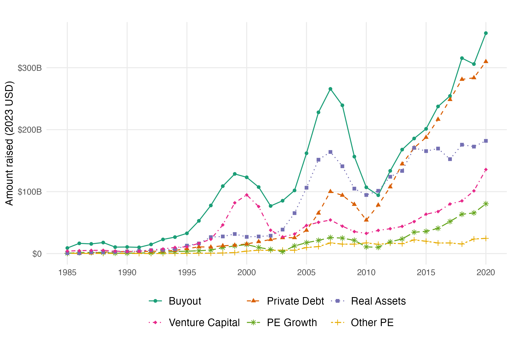

# The New Private Equity: Corporate Raider, Main Street Invader, Monopoly Builder, Shadow Owner

## By Charlie Eaton, Albina Gibadullina, Adam Goldstein, and Marie-Lou Laprise

*Note: AI coding assistants (Claude Code and OpenAI Codex) were used to edit or write some of the scripts in this replication package and to draft this README following the Higher Education DataHub's repository conventions. Generative AI was not used to draft the text of the paper or its appendix.*

Summary: We assembled deal-level data from PitchBook on 56,974 buyouts and 21,363 exits from 1985 to 2019, augmented with derived deal type classifications and deal size imputations, to provide a descriptive anatomy of private equity's shifting strategies and ownership patterns in the US economy.

**Data**
  - PitchBook US Buyout and Exit Deals
  - PitchBook US Private Funds
  - Federal Reserve Financial Accounts of the United States: Nonfinancial Corporate Net Worth at Historical Cost (Table B.103) and Nonfinancial Noncorporate Net Worth (Table B.104)
  - SEC Form PF Private Fund Statistics (Gross Assets of Private Equity and Venture Capital Funds)
  - Compustat Fundamentals Annual (Stockholders' Equity, Variable SEQ)
  - LSEG (previously Refinitiv) US M&A Deals

**Abstract**

Private equity investment funds command increasing wealth and reach in the US economy, yet the scope and role of private equity (PE) remain ambiguous. This paper assembles systematic data to provide a descriptive anatomy of PE's shifting strategies and ownership patterns in the US since the 1980s. We theorize four interconnected roles—"corporate raider," "Main Street invader," "monopoly builder," and "shadow owner." We then document the changing balance among them over time. We find a shift away from PE's traditional role as corporate raiders that specialize in restructuring publicly traded firms. Instead, PE investors are increasingly focusing on agglomerating and rationalizing already private "Main Street" companies. PE-owned companies also increasingly stay private through longer hold times and sales to other PE funds. PE's expansion has helped spread the logic of shareholder value maximization to ever more corners of the economy, but without the relative transparency and regulation of publicly traded companies.

The repository has a separate file for each table and figure in the paper. File names for files that replicate tables all start t1_, t2_ etc. for table 1, table 2 etc. For replicating figures, they all start f1, f2, etc. For appendix tables, they start ta1, ta2, etc.

If you click on the link for a notebook for any given table/figure in the repository, Github will render both the code and any figures or tables from the notebook.

The following is Figure 1 from the paper, Funds Raised by US Private Funds by Fund Type (3-Year Rolling Average):

