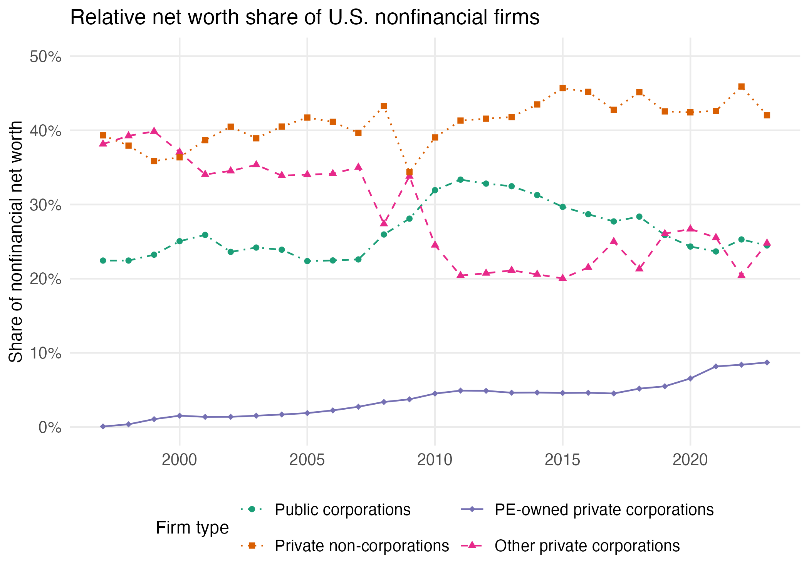

Figure 2
================

``` r
library(tidyverse)
library(readxl)
library(data.table)
```

Load files

``` r
data <- read.csv("d_net_worth_listed_firms.csv")
```

Net worth breakdown of US nonfinancial firms (HISTORICAL) using Federal
Reserve data with PE ownership

``` r
networth_breakdown_all <- data %>% 
  filter(Year>1996, Year<2024) %>% 
  mutate(Private_corporations_Other = (Corporate_networth_historical-equity_listed_nonFI_book-Pitchbook_PE_VC_Inv)/(Corporate_networth_historical +Noncorporate_networth),
         Private_corporations_PE = (Pitchbook_PE_VC_Inv)/(Corporate_networth_historical +Noncorporate_networth),
         Listed_corporations = equity_listed_nonFI_book/(Corporate_networth_historical +Noncorporate_networth),
         Private_corporations = (Corporate_networth_historical-equity_listed_nonFI_book)/(Corporate_networth_historical+Noncorporate_networth),
         Private_noncorporations = Noncorporate_networth/(Corporate_networth_historical+Noncorporate_networth)) %>% 
  select(Year, Listed_corporations, Private_corporations_Other, Private_noncorporations, Private_corporations_PE) %>%
  pivot_longer(cols = c("Listed_corporations", "Private_corporations_Other", 
                        "Private_noncorporations", "Private_corporations_PE"),
    names_to = "Firm_type",
    values_to = "value") %>%  
  mutate(Firm_type = case_when(Firm_type == "Private_noncorporations" ~ "Private non-corporations",
                               Firm_type == "Private_corporations_Other" ~ "Other private corporations",
                               Firm_type == "Private_corporations_PE" ~ "PE-owned private corporations",
                               Firm_type == "Listed_corporations" ~ "Public corporations")) %>% 
  mutate(Firm_type = fct_relevel(Firm_type, "Public corporations", "Private non-corporations", "PE-owned private corporations", "Other private corporations")) %>% 
  ggplot(aes(x = Year, y = value, color = Firm_type, linetype = Firm_type, shape = Firm_type)) +
  geom_line() +
  geom_point(size = 1.5) +
  scale_color_brewer(palette = "Dark2") +
  scale_linetype_manual(
    values = c("Public corporations"      = "dotdash",
               "PE-owned private corporations"  =  "solid",
               "Other private corporations"     = "dashed",
               "Private non-corporations" = "dotted")) +
  scale_shape_manual(
    values = c("Public corporations"      = 16,
               "PE-owned private corporations" = 18,
               "Other private corporations"     = 17,
               "Private non-corporations" = 15)) +
  scale_y_continuous(labels = scales::percent_format(accuracy = 1), limits = c(0, 0.50)) +
  scale_x_continuous(breaks = c(2000, 2005, 2010, 2015, 2020)) +
  labs(title  = "Relative net worth share of U.S. nonfinancial firms", 
       color    = "Firm type",
       linetype = "Firm type",
       shape    = "Firm type",
       y = "Share of nonfinancial net worth") +
  guides(color    = guide_legend(nrow = 2),
         linetype = guide_legend(nrow = 2),
         shape    = guide_legend(nrow = 2)) +
  theme_minimal() +
  theme(legend.position  = "bottom", 
        panel.grid.minor = element_blank(),
        legend.text      = element_text(size = 10),
        legend.title     = element_text(size = 11),
        axis.title.y     = element_text(size = 11),
        axis.title.x     = element_blank(),
        axis.text        = element_text(size = 10))

ggsave(plot = networth_breakdown_all, "figures/f2_net_worth.png", height = 5, width = 7)
knitr::include_graphics("../figures/f2_net_worth.png", error = FALSE)
```

<!-- -->
