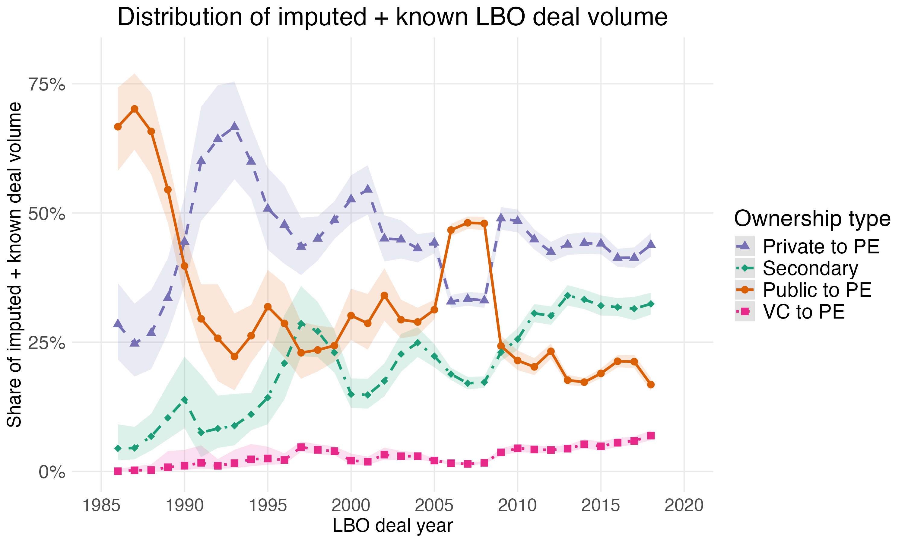
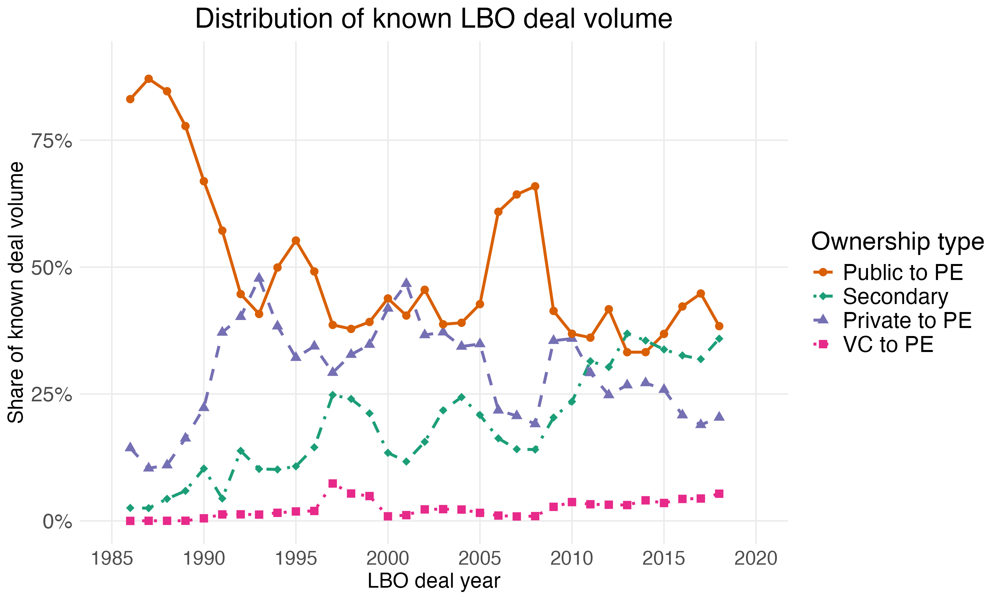

Figure 4
================

``` r
library(tidyverse)
library(data.table)
library(slider)
```

Figure 4 - imputed and known with ribbons

``` r
# ---- 0. Load imputations ------------------------
imp     <- readRDS("imputed_data_nopubliccap.Rds")
datlist <- miceadds::mids2datlist(imp)
M       <- length(datlist)

types  <- c("Public to PE", "Private to PE", "VC to PE", "Secondary")
logit  <- function(p) log(p / (1 - p))
expit  <- function(x) 1 / (1 + exp(-x))

# ---- 1. Per-imputation, per-type SHARE with centered 3-yr smoothing -------
#  total volume within each imputation, then pool the shares.)
share_by_imp <- rbindlist(lapply(seq_along(datlist), function(k) {
  dt <- as.data.table(datlist[[k]])[!is.na(dealyear)]

  # use the imputed deal-size column; Figure 5 uses dealsize_2023d
  agg <- dt[, .(deal_size = sum(dealsize_2023d, na.rm = TRUE) / 1e6),
            by = .(dealyear, transfertype)]

  grid <- CJ(dealyear = 1985:2019, transfertype = types)
  agg  <- agg[grid, on = .(dealyear, transfertype)]
  agg[is.na(deal_size), deal_size := 0]

  agg[, deal_volume := sum(deal_size), by = dealyear]   # yearly denominator
  setorder(agg, transfertype, dealyear)
  agg[, `:=`(
    rolling_deal_size = frollmean(deal_size,   n = 3, align = "center"),
    rolling_volume    = frollmean(deal_volume, n = 3, align = "center")
  ), by = transfertype]
  agg[, share := rolling_deal_size / rolling_volume]
  agg[, .(m = k, dealyear, transfertype, share)]
}))

# ---- 2. Pool shares across imputations (Rubin, logit scale) ---------------
pooled_share <- share_by_imp[
  !is.na(share) & share > 0 & share < 1,
  {
    z      <- logit(share)
    zbar   <- mean(z)
    B      <- var(z)
    n_imp  <- .N
    se     <- sqrt((1 + 1 / n_imp) * B)
    t_crit <- qt(0.975, df = n_imp - 1)
    list(share = expit(zbar),                  # pooled point estimate
         lower = expit(zbar - t_crit * se),
         upper = expit(zbar + t_crit * se))
  },
  by = .(dealyear, transfertype)
]

# ---- 3. Assemble plotting frame -------------------------------------------
plot_dt <- pooled_share[dealyear >= 1984 & dealyear <= 2019]
plot_dt[, transfertype := factor(transfertype,
        levels = c("Private to PE", "Secondary", "Public to PE", "VC to PE"))]

# ---- 4. Plot (Figure 4 ribbon idiom, shares instead of dollars) -----------
p6 <- ggplot(plot_dt, aes(x = dealyear, y = share,
             color = transfertype, linetype = transfertype, shape = transfertype)) +
  geom_ribbon(aes(ymin = lower, ymax = upper, fill = transfertype),
              alpha = 0.15, colour = NA) +
  geom_line(size = 1) +
  geom_point(size = 2.5) +
  scale_color_manual(
    values = c("Public to PE"  = "#D95F02",
               "Private to PE" = "#7570B3",
               "VC to PE"      = "#E7298A",
               "Secondary"     = "#1B9E77")) +
  scale_fill_manual(
    values = c("Public to PE"  = "#D95F02",
               "Private to PE" = "#7570B3",
               "VC to PE"      = "#E7298A",
               "Secondary"     = "#1B9E77"),
    guide = "none") +
  scale_linetype_manual(
    values = c("Public to PE"  = "solid",
               "Private to PE" = "dashed",
               "VC to PE"      = "dotted",
               "Secondary"     = "dotdash")) +
  scale_shape_manual(
    values = c("Public to PE"  = 16,
               "Private to PE" = 17,
               "VC to PE"      = 15,
               "Secondary"     = 18)) +
  scale_y_continuous(labels = scales::percent_format(accuracy = 1),
                     breaks = seq(0, 1, 0.25), limits = c(0, 0.8)) +
  scale_x_continuous(breaks = c(1985, 1990, 1995, 2000, 2005, 2010, 2015, 2020),
                     limits = c(1985, 2020)) +
  labs(x        = "LBO deal year",
       y        = "Share of imputed + known deal volume",
       title    = "Distribution of imputed + known LBO deal volume",
       color    = "Ownership type",
       linetype = "Ownership type",
       shape    = "Ownership type") +
  theme_minimal() +
  theme(legend.position  = "right",
        axis.title.x     = element_text(size = 15),
        axis.title.y     = element_text(size = 15),
        axis.text.x      = element_text(size = 14),
        axis.text.y      = element_text(size = 15),
        plot.title       = element_text(size = 20, hjust = 0.5),
        legend.text      = element_text(size = 16),
        legend.title     = element_text(size = 18),
        panel.background = element_rect(fill = "white", colour = NA),
        plot.background  = element_rect(fill = "white", colour = NA),
        panel.grid.minor = element_blank())
```

    ## Warning: Using `size` aesthetic for lines was deprecated in ggplot2 3.4.0.
    ## ℹ Please use `linewidth` instead.
    ## This warning is displayed once per session.
    ## Call `lifecycle::last_lifecycle_warnings()` to see where this warning was
    ## generated.

``` r
ggsave("figures/f4_buyout_type_volume_imputed.png", p6, height = 6, width = 10)
knitr::include_graphics("../figures/f4_buyout_type_volume_imputed.png", error = FALSE)
```

<!-- -->

Figure 4 - known deal volume only

``` r
imp_obj <- readRDS("imputed_data_nopubliccap.Rds")

# Original data (with NAs)
orig <- as.data.table(imp_obj$data)

# Row indices where variables were missing
mis_dealsize <- which(imp_obj$where[, "dealsize_2023d"])
# Extract imputed matrix
imp_reg      <- as.data.table(imp_obj$imp$dealsize_2023d)

setnames(
  imp_reg,
  old  = names(imp_reg),
  new  = paste0("imp", seq_along(imp_reg))
)


# Attach row indices and dealid
dt_reg <- data.table(
  row = mis_dealsize,
  imp_reg
)

dt_reg[, dealid := orig$dealid[row]]

# Compute mean ONLY across imputations (one mean per dealid, only where missing originally)

means_dealsize <- dt_reg[
  , .(dealsize_2023d_imputed = rowMeans(.SD, na.rm = TRUE)),
  by = dealid,
  .SDcols = patterns("^imp")
]

# Merge into the original file
buyout_deals_imputed <- left_join(orig, means_dealsize, by = "dealid")

buyout_deals_imputed <- buyout_deals_imputed %>% 
  mutate(dealsize_2023d_all = ifelse(!is.na(dealsize_2023d), dealsize_2023d, dealsize_2023d_imputed)) %>% 
  mutate(known_deal_size = ifelse(!is.na(dealsize_2023d), "known", "imputed"))

df <- buyout_deals_imputed %>%
  filter(!is.na(dealyear)) %>%
  group_by(dealyear, transfertype) %>%
  summarise(count = n(),
            deal_size = sum(dealsize_2023d, na.rm = TRUE)/1e6,
            .groups = "drop") %>%
  # Ensure all combinations exist
  complete(dealyear = 1985:2019,
           transfertype = c("Public to PE", "Private to PE", "VC to PE", "Secondary"),
           fill = list(count = 0, deal_size = 0)) %>% 
  # Get total per year (for share calculations)
  group_by(dealyear) %>%
  mutate(deal_volume = sum(deal_size, na.rm = TRUE),
         deal_count = sum(count)) %>%
  ungroup() %>%
  # Rolling calculations
  arrange(dealyear) %>%
  group_by(transfertype) %>%
  mutate(rolling_deal_size = slide_dbl(deal_size, mean, .before = 1, .after = 1, .complete = TRUE),
         rolling_count = slide_dbl(count, mean, .before = 1, .after = 1, .complete = TRUE),
         rolling_volume = slide_dbl(deal_volume, mean, .before = 1, .after = 1, .complete = TRUE),
         rolling_total_count = slide_dbl(deal_count, mean, .before = 1, .after = 1, .complete = TRUE),
         deal_size_share = rolling_deal_size / rolling_volume,
         deal_count_share = rolling_count / rolling_total_count) %>%
  ungroup() %>%  
  filter(dealyear>=1986, dealyear <= 2019) %>% 
  mutate(transfertype = as.factor(transfertype)) %>% 
  mutate(transfertype = fct_relevel(transfertype, "Public to PE", "Secondary", "Private to PE", "VC to PE")) %>% 
  ggplot(aes(x = dealyear, y = deal_size_share,
             color = transfertype, linetype = transfertype, shape = transfertype)) +
  geom_line(size = 1) +
  geom_point(size = 2.5) +
  scale_color_manual(
    values = c("Public to PE"  = "#D95F02",
             "Private to PE" = "#7570B3",
             "VC to PE"      = "#E7298A", 
             "Secondary"     = "#1B9E77"))+
  scale_linetype_manual(
    values = c("Public to PE"   = "solid",
               "Private to PE"  = "dashed",
               "VC to PE"       = "dotted",
               "Secondary"      = "dotdash")) +
  scale_shape_manual(
    values = c("Public to PE"   = 16,
               "Private to PE"  = 17,
               "VC to PE"       = 15,
               "Secondary"      = 18)) +
  scale_y_continuous(labels = scales::percent_format(accuracy = 1),
                     breaks = seq(0, 1, 0.25), limits = c(0, 0.9)) +
  scale_x_continuous(breaks = c(1985, 1990, 1995, 2000, 2005, 2010, 2015, 2020),
                     limits = c(1985, 2020)) +
  labs(x        = "LBO deal year",
       y        = "Share of known deal volume",
       title    = "Distribution of known LBO deal volume",
       color    = "Ownership type",
       linetype = "Ownership type",
       shape    = "Ownership type") +
  theme_minimal() +
  theme(legend.position  = "right",
        axis.title.x     = element_text(size = 15),
        axis.title.y     = element_text(size = 15),
        axis.text.x      = element_text(size = 14),
        axis.text.y      = element_text(size = 15),
        plot.title       = element_text(size = 20, hjust = 0.5),
        legend.text      = element_text(size = 16),
        legend.title     = element_text(size = 18),
        panel.background = element_rect(fill = "white", colour = NA),
        plot.background  = element_rect(fill = "white", colour = NA),
        panel.grid.minor = element_blank())
  
  
ggsave("figures/f4_buyout_type_volume_known.png", df, height = 6, width = 10)
```

    ## Warning: Removed 4 rows containing missing values or values outside the scale range
    ## (`geom_line()`).

    ## Warning: Removed 4 rows containing missing values or values outside the scale range
    ## (`geom_point()`).

``` r
knitr::include_graphics("../figures/f4_buyout_type_volume_known.png", error = FALSE)
```

<!-- -->
