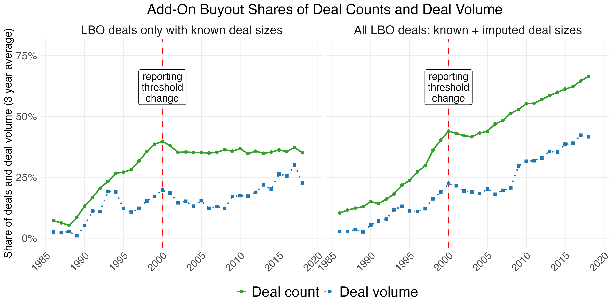

Figure 5
================

``` r
library(tidyverse)
library(data.table)
library(slider)
```

Load imputed LBO data

``` r
imp_obj <- readRDS("imputed_data_nopubliccap.Rds")

# Original data (with NAs)
orig <- as.data.table(imp_obj$data)

# Row indices where variables were missing
mis_dealsize <- which(imp_obj$where[, "dealsize_2023d"])
# Extract imputed matrix
imp_reg      <- as.data.table(imp_obj$imp$dealsize_2023d)

setnames(
  imp_reg,
  old  = names(imp_reg),
  new  = paste0("imp", seq_along(imp_reg))
)


# Attach row indices and dealid
dt_reg <- data.table(
  row = mis_dealsize,
  imp_reg
)

dt_reg[, dealid := orig$dealid[row]]

# Compute mean ONLY across imputations (one mean per dealid, only where missing originally)

means_dealsize <- dt_reg[
  , .(dealsize_2023d_imputed = rowMeans(.SD, na.rm = TRUE)),
  by = dealid,
  .SDcols = patterns("^imp")
]

# Merge into the original file
buyout_deals_imputed <- left_join(orig, means_dealsize, by = "dealid")

buyout_deals_imputed <- buyout_deals_imputed %>% 
  mutate(dealsize_2023d_all = ifelse(!is.na(dealsize_2023d), dealsize_2023d, dealsize_2023d_imputed)) %>% 
  mutate(known_deal_size = ifelse(!is.na(dealsize_2023d), "known", "imputed"))
```

Figure 5 - add-ons

``` r
# Helper: compute the All-LBOs add-on shares for a given input table
compute_addons_all <- function(df) {
  df %>%
    filter(!is.na(dealyear)) %>%
    group_by(dealyear, transfertype, addon) %>%
    summarise(
      count = n(),
      deal_size = sum(dealsize_2023d_all, na.rm = TRUE) / 1e6,
      .groups = "drop"
    ) %>%
    group_by(dealyear, transfertype) %>%
    mutate(
      count_total = sum(count, na.rm = TRUE),
      deal_size_total = sum(deal_size, na.rm = TRUE)
    ) %>%
    ungroup() %>%
    filter(addon == 0) %>%
    arrange(dealyear) %>%
    group_by(transfertype) %>%
    mutate(
      rolling_count       = slide_dbl(count, mean, .before = 1, .after = 1, .complete = TRUE),
      rolling_total_count = slide_dbl(count_total, mean, .before = 1, .after = 1, .complete = TRUE),
      rolling_deal_size   = slide_dbl(deal_size, mean, .before = 1, .after = 1, .complete = TRUE),
      rolling_volume      = slide_dbl(deal_size_total, mean, .before = 1, .after = 1, .complete = TRUE)
    ) %>%
    ungroup() %>%
    # collapse all transfertypes into a single "All LBOs" aggregate
    group_by(dealyear) %>%
    summarise(
      rolling_count       = sum(rolling_count, na.rm = TRUE),
      rolling_total_count = sum(rolling_total_count, na.rm = TRUE),
      rolling_deal_size   = sum(rolling_deal_size, na.rm = TRUE),
      rolling_volume      = sum(rolling_volume, na.rm = TRUE),
      share_volume = (rolling_volume - rolling_deal_size) / rolling_volume,
      share_count  = (rolling_total_count - rolling_count) / rolling_total_count,
      .groups = "drop"
    )
}

# Two panels = two data sources
addons_known <- compute_addons_all(
  buyout_deals_imputed %>% filter(known_deal_size == "known")
) %>% mutate(source = "LBO deals only with known deal sizes")

addons_imputed <- compute_addons_all(
  buyout_deals_imputed
) %>% mutate(source = "All LBO deals: known + imputed deal sizes")

addons_plot <- bind_rows(addons_known, addons_imputed) %>%
  pivot_longer(
    cols = starts_with("share_"),
    names_to = "variable",
    values_to = "share"
  ) %>%
  mutate(
    variable = ifelse(variable == "share_volume", "Deal volume", "Deal count"),
    source = factor(source, levels = c("LBO deals only with known deal sizes", "All LBO deals: known + imputed deal sizes"))
  ) %>%
  filter(dealyear >= 1986, dealyear <= 2020)

addons <- ggplot(addons_plot, aes(x = dealyear, y = share,
                                  color = variable, linetype = variable, shape = variable)) +
  geom_vline(xintercept = 2000, color = "red", linetype = "dashed", linewidth = 1) +
  annotate("label", x = 2000, y = 0.62, label = "reporting\nthreshold\nchange",
           size = 5, hjust = 0.5, lineheight = 0.9, fill = "white") +
  geom_line(size = 1) +
  geom_point(size = 2) +
  facet_wrap(~ source) +
  scale_color_manual(values = c("#33A02C", "#1F78B4")) +
  scale_linetype_manual(values = c("solid", "dotted")) +
  scale_shape_manual(values = c(16, 15)) +
  scale_y_continuous(
    labels = scales::percent_format(accuracy = 1),
    breaks = seq(0, 0.75, 0.25),
    limits = c(0, 0.78)) +
  scale_x_continuous(breaks = c(1985, 1990, 1995, 2000, 2005, 2010, 2015, 2020)) +
  labs(
    title    = "Add-On Buyout Shares of Deal Counts and Deal Volume",
    y = "Share of deals and deal volume (3 year average)",
    color    = "", linetype = "", shape = "") +
  theme_minimal() +
  theme(legend.position  = "bottom",
        panel.background = element_rect(fill = "white", colour = NA),
        plot.background  = element_rect(fill = "white", colour = NA),
        axis.title.x     = element_blank(),
        axis.title.y     = element_text(size = 15),
        axis.text.x      = element_text(size = 14, angle = 45, hjust = 1),
        axis.text.y      = element_text(size = 15),
        plot.title       = element_text(size = 20, hjust = 0.5),
        legend.text      = element_text(size = 20),
        strip.text       = element_text(size = 17),
        panel.grid.minor = element_blank())
```

    ## Warning: Using `size` aesthetic for lines was deprecated in ggplot2 3.4.0.
    ## ℹ Please use `linewidth` instead.
    ## This warning is displayed once per session.
    ## Call `lifecycle::last_lifecycle_warnings()` to see where this warning was
    ## generated.

``` r
ggsave("figures/f5_addon_shares.png", addons, height = 6, width = 12)
```

    ## Warning: Removed 4 rows containing missing values or values outside the scale range
    ## (`geom_line()`).

    ## Warning: Removed 4 rows containing missing values or values outside the scale range
    ## (`geom_point()`).

``` r
knitr::include_graphics("../figures/f5_addon_shares.png", error = FALSE)
```

<!-- -->
