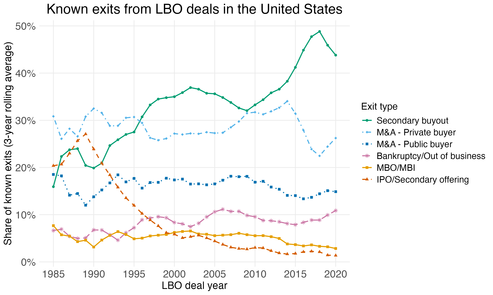

Figure 6
================

``` r
library(tidyverse)
library(slider)
library(scales)
```

Figure 6 Exits from LBOs (3 year rolling average)

``` r
buyout_exits_status <- readRDS("buyout_exits_status.RDS")

buyout_exits_revised_line <- buyout_exits_status %>% 
  # ---- exit type harmonization ----
  mutate(
    exit_type = case_when(
      #exit_type %in% c("Investor Buyout by Management", "Secondary buyout") ~ "Secondary buyout/MBO",
      exit_type %in% c("Secondary buyout") ~ "Secondary buyout",
      exit_type %in% c("Investor Buyout by Management") ~ "MBO/MBI",
      exit_type %in% c("Bankruptcy", "Out of business") ~ "Bankruptcy/Out of business",
      exit_type == "M&A" & investor_listed == "Private" ~ "M&A - Private buyer",
      exit_type == "M&A" & investor_listed == "Listed" ~ "M&A - Public buyer",
      TRUE ~ exit_type
    )
  ) %>% 
  mutate(exit_type = ifelse(exit_type == "M&A", "M&A - Private buyer", exit_type)) %>% 
  mutate(exit_type = as.factor(exit_type)) %>% 
  mutate(
    exit_type = fct_relevel(
      exit_type,
      "Secondary buyout",
      "M&A - Private buyer",
      "M&A - Public buyer",
      "Bankruptcy/Out of business",
      "MBO/MBI",
      "IPO/Secondary offering")
  ) %>% 
  filter(exit_type != "No exit information") %>% 
  filter(ml_dealyear > 1983, ml_dealyear < 2022) %>% 
  # ---- yearly aggregation ----
  group_by(ml_dealyear) %>% 
  mutate(total_count = n()) %>% 
  group_by(exit_type, ml_dealyear, total_count) %>% 
  summarise(count = n(), .groups = "drop") %>% 
  mutate(count_share = count / total_count) %>% 
  # ---- 3-year rolling average (centered) ----
  arrange(exit_type, ml_dealyear) %>% 
  group_by(exit_type) %>% 
  mutate(
    count_share_roll3 = slide_dbl(
      count_share,
      mean,
      .before  = 1,
      .after   = 1,
      .complete = TRUE
    )
  ) %>% 
  ungroup() %>% 
  filter(!is.na(count_share_roll3)) %>% 
  # ---- plotting ----
  #filter(exit_type != "MBO") %>% 
  ggplot(aes(
    x        = ml_dealyear,
    y        = count_share_roll3,
    color    = exit_type,
    linetype = exit_type,
    shape    = exit_type,
    group    = exit_type
  )) +
  geom_line(size = 0.75) +
  geom_point(size = 1.5) +
  scale_color_manual(
    values = c("Bankruptcy/Out of business" = "#CC79A7",
               "IPO/Secondary offering"     = "#D55E00",
               "M&A - Public buyer"         = "#0072B2",
               "M&A - Private buyer"        = "#56B4E9",
               "Secondary buyout"       = "#009E73",
               "MBO/MBI" = "#E69F00"))+
  scale_linetype_manual(
    values = c("Bankruptcy/Out of business" = "longdash",
               "IPO/Secondary offering"     = "dashed",
               "M&A - Public buyer"         = "dotted",
               "M&A - Private buyer"        = "dotdash",
               "Secondary buyout"       = "solid",
               "MBO/MBI" = "solid")) +
  scale_shape_manual(
    values = c("Bankruptcy/Out of business" = 8,
               "IPO/Secondary offering"     = 17,
               "M&A - Public buyer"         = 15,
               "M&A - Private buyer"        = 18,
               "Secondary buyout"       = 16,
               "MBO/MBI" = 15)) +
  scale_y_continuous(
    labels = percent_format(accuracy = 1),
    breaks = seq(0, 1, by = 0.1)
  ) +
  scale_x_continuous(
     breaks = c(1985, 1990, 1995, 2000, 2005, 2010, 2015, 2020)
    )+
  labs(
    x        = "LBO deal year",
    y        = "Share of known exits (3-year rolling average)",
    title    = "Known exits from LBO deals in the United States",
    color    = "Exit type",
    linetype = "Exit type",
    shape    = "Exit type"
  ) +
  theme_minimal() +
  theme(
    legend.position  = "right",
    panel.background = element_rect(fill = "white", colour = NA),
    plot.background  = element_rect(fill = "white", colour = NA),
    axis.title.x     = element_text(size = 15),
    axis.title.y     = element_text(size = 15),
    plot.title       = element_text(size = 20, hjust = 0.5),
    axis.text.x      = element_text(size = 15),
    axis.text.y      = element_text(size = 15),
    legend.text      = element_text(size = 13),
    legend.title     = element_text(size = 14),
    panel.grid.minor = element_blank()
  )
```

    ## Warning: Using `size` aesthetic for lines was deprecated in ggplot2 3.4.0.
    ## ℹ Please use `linewidth` instead.
    ## This warning is displayed once per session.
    ## Call `lifecycle::last_lifecycle_warnings()` to see where this warning was
    ## generated.

``` r
ggsave("figures/f6_exit_types.png", buyout_exits_revised_line, height = 6, width = 10)
knitr::include_graphics("../figures/f6_exit_types.png", error = FALSE)
```

<!-- -->
