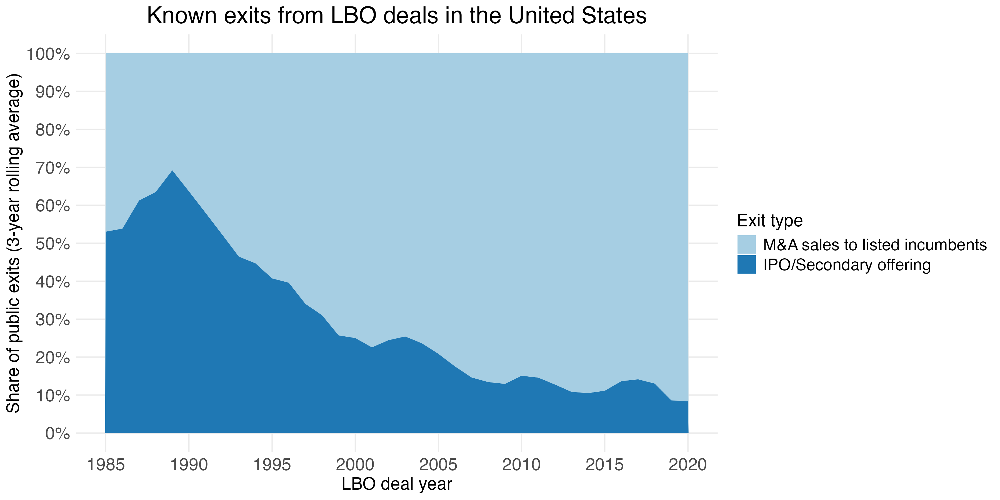

Figure 7
================

``` r
library(tidyverse)
library(slider)
library(scales)
```

Figure 7 - IPO vs M&A among exits to public firms (3 rolling average)

``` r
buyout_exits_status <- readRDS("buyout_exits_status.RDS")

buyout_exits_public <- buyout_exits_status %>% 
  # ---- recode exit types ----
  mutate(
    exit_type = case_when(
      exit_type == "M&A" & investor_listed == "Private" ~ "M&A sales to private incumbents",
      exit_type == "M&A" & investor_listed == "Listed"  ~ "M&A sales to listed incumbents",
      TRUE ~ exit_type
    )
  ) %>%
  filter(exit_type %in% c("IPO/Secondary offering", "M&A sales to listed incumbents")) %>% 
  mutate(
    exit_type = fct_relevel(
      exit_type,
      "M&A sales to listed incumbents",
      "IPO/Secondary offering"
    )
  ) %>% 
  filter(ml_dealyear > 1983, ml_dealyear < 2022) %>% 

  # ---- yearly aggregation ----
  group_by(ml_dealyear) %>% 
  mutate(total_count = n()) %>% 
  group_by(exit_type, ml_dealyear, total_count) %>% 
  summarise(count = n(), .groups = "drop") %>% 
  mutate(count_share = count / total_count) %>% 

  # ---- 3-year rolling average ----
  arrange(exit_type, ml_dealyear) %>% 
  group_by(exit_type) %>% 
  mutate(
    count_share_roll3 = slide_dbl(
      count_share,
      mean,
      .before = 1,
      .after  = 1,
      .complete = TRUE
    )
  ) %>% 
  ungroup() %>% 
  filter(!is.na(count_share_roll3)) %>% 

  # ---- re-normalize so stacked areas sum to 1 ----
  group_by(ml_dealyear) %>% 
  mutate(count_share_roll3 = count_share_roll3 / sum(count_share_roll3)) %>% 
  ungroup() %>% 

  # ---- plot ----
  ggplot(aes(
    x = ml_dealyear,
    y = count_share_roll3,
    fill = exit_type,
    group = exit_type
  )) +
  geom_area() +
  scale_fill_manual(values = c("#A6CEE3", "#1F78B4")) +
  scale_y_continuous(
    labels = percent_format(accuracy = 1),
    breaks = seq(0, 1, by = 0.1)
  ) +
  scale_x_continuous(
     breaks = c(1985, 1990, 1995, 2000, 2005, 2010, 2015, 2020)
    )+
  labs(
    x = "LBO deal year",
    y = "Share of public exits (3-year rolling average)",
    title = "Known exits from LBO deals in the United States",
    fill = "Exit type"
  ) +
  theme_minimal() +
  theme(
    legend.position = "right",
    panel.background = element_rect(fill = "white", colour = NA),
    plot.background  = element_rect(fill = "white", colour = NA),
    axis.title.x = element_text(size = 15),
    axis.title.y = element_text(size = 15),
    plot.title = element_text(size = 20, hjust = 0.5),
    axis.text.x = element_text(size = 15),
    axis.text.y = element_text(size = 15),
    legend.text = element_text(size = 14),
    legend.title = element_text(size = 15),
    panel.grid.minor = element_blank()
  )

ggsave("figures/f7_public_exits.png", buyout_exits_public, height = 6, width = 12)
knitr::include_graphics("../figures/f7_public_exits.png", error = FALSE)
```

<!-- -->
