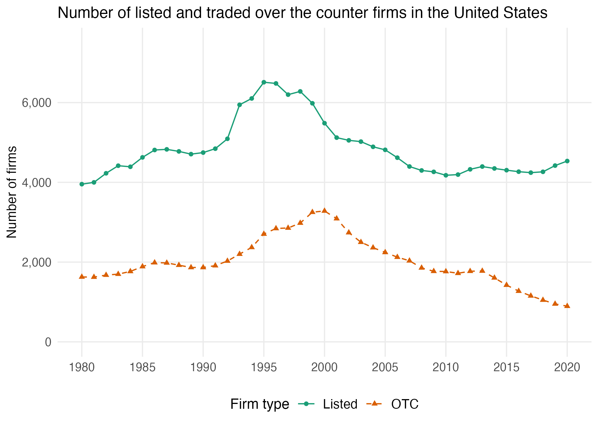

Figure A2
================

``` r
library(tidyverse)
library(readxl)
library(data.table)
```

Load files

``` r
data <- read.csv("d_net_worth_listed_firms.csv")
```

Figure A2

``` r
firm_count <- data %>% 
  filter(Year>1979, Year<2021) %>% 
  mutate(All = listed + OTC) %>% 
  select(Year, All, listed, OTC) %>% 
  pivot_longer(cols = c("All", "listed", "OTC"),
    names_to = "Firm_type",
    values_to = "value") %>%  
  mutate(Firm_type = case_when(Firm_type == "All" ~ "Listed + OTC",
                               Firm_type == "listed" ~ "Listed",
                               Firm_type == "OTC" ~ "OTC")) %>% 
  mutate(Firm_type = fct_relevel(Firm_type, "Listed + OTC", "Listed", "OTC")) %>% 
  filter(Firm_type != "Listed + OTC") %>% 
  ggplot(aes(x = Year, y = value, color = Firm_type, linetype = Firm_type, shape = Firm_type)) +
  geom_line() +
  geom_point(size = 1.5) +
  scale_color_brewer(palette = "Dark2") +
  scale_linetype_manual(
    values = c("Listed" = "solid",
               "OTC"    = "dashed")) +
  scale_shape_manual(
    values = c("Listed" = 16,
               "OTC"    = 17)) +
  scale_y_continuous(labels = scales::comma, limits = c(1, 7500)) +
  scale_x_continuous(breaks = c(1980, 1985, 1990, 1995, 2000, 2005, 2010, 2015, 2020)) +
  labs(title    = "Number of listed and traded over the counter firms in the United States", 
       color    = "Firm type",
       linetype = "Firm type",
       shape    = "Firm type",
       y = "Number of firms") +
  theme_minimal() +
  theme(legend.position  = "bottom", 
        panel.grid.minor = element_blank(),
        legend.text      = element_text(size = 11),
        legend.title     = element_text(size = 12),
        axis.title.y     = element_text(size = 11),
        axis.title.x     = element_blank(),
        axis.text        = element_text(size = 10))

ggsave(plot = firm_count, "figures/fa2_listed_firm_counts.png", height = 5, width = 7)
knitr::include_graphics("../figures/fa2_listed_firm_counts.png", error = FALSE)
```

<!-- -->
