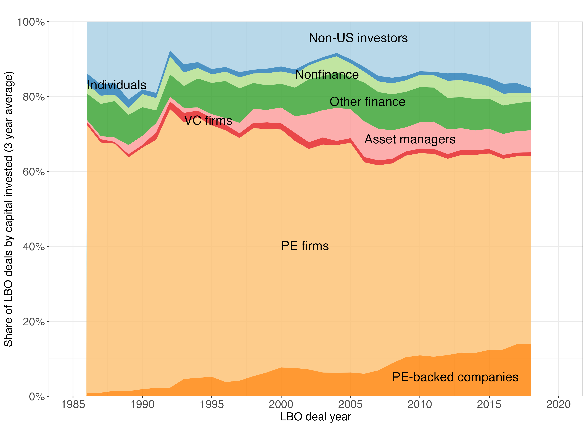

FigureA3
================

``` r
library(tidyverse)
library(data.table)
```

Load imputed LBO data + info on investors

``` r
companies <- fread("allcompanies.csv")
deals_investors <- fread("alldealswithinvestors.csv")
imp_obj <- readRDS("imputed_data_nopubliccap.Rds")

# Original data (with NAs)
orig <- as.data.table(imp_obj$data)

# Row indices where variables were missing
mis_dealsize <- which(imp_obj$where[, "dealsize_2023d"])
# Extract imputed matrix
imp_reg      <- as.data.table(imp_obj$imp$dealsize_2023d)

setnames(
  imp_reg,
  old  = names(imp_reg),
  new  = paste0("imp", seq_along(imp_reg))
)


# Attach row indices and dealid
dt_reg <- data.table(
  row = mis_dealsize,
  imp_reg
)

dt_reg[, dealid := orig$dealid[row]]

# Compute mean ONLY across imputations (one mean per dealid, only where missing originally)

means_dealsize <- dt_reg[
  , .(dealsize_2023d_imputed = rowMeans(.SD, na.rm = TRUE)),
  by = dealid,
  .SDcols = patterns("^imp")
]

# Merge into the original file
buyout_deals_imputed <- left_join(orig, means_dealsize, by = "dealid")

buyout_deals_imputed <- buyout_deals_imputed %>% 
  mutate(dealsize_2023d_all = ifelse(!is.na(dealsize_2023d), dealsize_2023d, dealsize_2023d_imputed)) %>% 
  mutate(known_deal_size = ifelse(!is.na(dealsize_2023d), "known", "imputed"))
```

Figure Appendix 3: Investors in LBO deals

``` r
deals_info <- buyout_deals_imputed %>% 
  select(dealid, dealsize_2023d_all, transfertype)

deals_investors_buyouts <- left_join(deals_investors, companies, by = "companyid")
deals_investors_buyouts <- left_join(deals_investors_buyouts, deals_info, by = c("dealid"))

investor_composition <- deals_investors_buyouts %>% 
  filter(dealtype == "Buyout/LBO") %>% 
  filter(hd_hqcountry == "UNITED STATES") %>% 
  mutate(investor_US = ifelse(inv_hd_hqcountry == "UNITED STATES", "US","Non-US")) %>% 
  group_by(dealid) %>% 
  mutate(number_investors = n()) %>% 
  mutate(investment = dealsize_2023d_all/number_investors) %>% 
  mutate(investor_type = case_when(inv_hd_primaryinvestortype == "Asset Manager" ~ "Asset managers",
                                   inv_hd_primaryinvestortype == "Fund of Funds" ~ "Asset managers",
                                   inv_hd_primaryinvestortype == "Hedge Fund" ~ "Other finance",
                                   inv_hd_primaryinvestortype == "Impact Investing" ~ "Other finance",
                                   inv_hd_primaryinvestortype == "Investment Bank" ~ "Other finance",
                                   inv_hd_primaryinvestortype == "Sovereign Wealth Fund" ~ "Other finance",
                                   inv_hd_primaryinvestortype == "Venture Capital" ~ "VC firms",
                                   inv_hd_primaryinvestortype == "Growth/Expansion" ~ "PE firms",
                                   inv_hd_primaryinvestortype == "Angel Group" ~ "Other finance",
                                   inv_hd_primaryinvestortype == "Angel (individual)" ~ "Individuals",
                                   inv_hd_primaryinvestortype == "Family Office" ~ "Individuals",
                                   inv_hd_primaryinvestortype == "Government" ~ "Nonfinance",
                                   inv_hd_primaryinvestortype == "SBIC" ~ "Other finance",
                                   inv_hd_primaryinvestortype == "Infrastructure" ~ "Other finance",
                                   inv_hd_primaryinvestortype == "Lender/Debt Provider" ~ "Other finance",
                                   inv_hd_primaryinvestortype == "Merchant Banking Firm" ~ "Other finance",
                                   inv_hd_primaryinvestortype == "Mutual Fund" ~ "Asset managers",
                                   inv_hd_primaryinvestortype == "Mezzanine" ~ "Other finance",
                                   inv_hd_primaryinvestortype == "Real Estate" ~ "Other finance",
                                   inv_hd_primaryinvestortype == "Fundless Sponsor" ~ "Asset managers",
                                   inv_hd_primaryinvestortype == "Special Purpose Acquisition Company (SPAC)" ~ "Other finance",
                                   inv_hd_primaryinvestortype == "Corporate Development" ~ "Nonfinance",
                                   inv_hd_primaryinvestortype == "Accelerator/Incubator" ~ "Nonfinance",
                                   inv_hd_primaryinvestortype == "Corporation" ~ "Corporation",
                                   inv_hd_primaryinvestortype == "Business Development Company" ~ "Nonfinance",
                                   inv_hd_primaryinvestortype == "Corporate Venture Capital" ~ "Nonfinance",
                                   inv_hd_primaryinvestortype == "Holding Company" ~ "Nonfinance",
                                   inv_hd_primaryinvestortype == "PE-Backed Company" ~ "PE-backed companies",
                                   inv_hd_primaryinvestortype == "VC-Backed Company" ~ "Nonfinance",
                                   inv_hd_primaryinvestortype == "PE/Buyout" ~ "PE firms",
                                   inv_hd_primaryinvestortype == "Other Private Equity" ~ "PE firms",
                                   inv_hd_primaryinvestortype == "Limited Partner" ~ "Other finance",
                                   inv_hd_primaryinvestortype == "Not-For-Profit Venture Capital" ~ "Other finance",
                                   inv_hd_primaryinvestortype == "Secondary Buyer" ~ "PE firms",
                                   inv_hd_primaryinvestortype == "University" ~ "Nonfinance",
                                   inv_hd_primaryinvestortype == "" ~ "Nonfinance",
                                   inv_hd_primaryinvestortype == "Other" ~ "Nonfinance",
                                   TRUE ~ inv_hd_primaryinvestortype)) %>% 
  mutate(investor_type_updated = ifelse(investor_US == "US", investor_type, "Non-US investors")) %>%  
  mutate(investor_type_updated = ifelse(investor_type_updated == "Corporation" & dealtype2 == "Add-on", "PE-backed companies",
                                 ifelse(investor_type_updated == "Corporation" & dealtype2 != "Add-on", "Nonfinance",        
                                        investor_type_updated))) %>%  
  group_by(ml_dealyear) %>% 
  mutate(investment_total = sum(investment, na.rm = TRUE)) %>% 
  group_by(ml_dealyear, investor_type_updated, investment_total) %>% 
  summarise(investment_investor = sum(investment, na.rm = TRUE)) %>% 
  mutate(investment_share = investment_investor/investment_total) %>% 
  group_by(investor_type_updated) %>% 
  mutate(inv_share_lag_1 = lag(investment_share, 1),
         inv_share_lag_2 = lag(investment_share, 2),
         inv_share_lead_1 = lead(investment_share, 1),
         inv_share_lead_2 = lead(investment_share, 2)) %>% 
  ungroup() %>% 
  rowwise() %>% 
  mutate(roll_3yr = mean(c(investment_share, inv_share_lag_1, inv_share_lead_1), na.rm = TRUE),
         roll_5yr = mean(c(investment_share, inv_share_lag_1, inv_share_lead_1, inv_share_lag_2, inv_share_lead_2), na.rm = TRUE)) 
```

    ## `summarise()` has regrouped the output.
    ## ℹ Summaries were computed grouped by ml_dealyear, investor_type_updated, and
    ##   investment_total.
    ## ℹ Output is grouped by ml_dealyear and investor_type_updated.
    ## ℹ Use `summarise(.groups = "drop_last")` to silence this message.
    ## ℹ Use `summarise(.by = c(ml_dealyear, investor_type_updated,
    ##   investment_total))` for per-operation grouping (`?dplyr::dplyr_by`) instead.

``` r
# Based on $ investment value
stacked_labels <- data.frame(
  labels = c("Non-US investors", "Individuals", "Nonfinance", "Other finance", 
             "Asset managers", "VC firms", "PE firms", "PE-backed companies"),
  x = c(2002, 1986, 2001, 2003.5, 2006, 1993, 2000, 2008),
  y = c(0.945, 0.82, 0.848, 0.775, 0.675, 0.725, 0.39, 0.04))

investor_composition_ <- investor_composition %>% 
  mutate(investor_types = as.factor(investor_type_updated)) %>% 
  mutate(investor_types = fct_relevel(investor_types, "Non-US investors", "Individuals", "Nonfinance", "Other finance", "Asset managers", "VC firms", "PE firms", "PE-backed companies")) %>% 
  filter(ml_dealyear>1985, ml_dealyear <= 2018) %>% 
  ggplot(aes(x=ml_dealyear, y = roll_3yr))+
  geom_area(aes(fill = investor_types), position = "fill", size = .2, alpha = 0.8) +
  scale_fill_brewer(palette = "Paired")+
  scale_y_continuous(labels = scales::percent_format(accuracy = 1), breaks = seq(0, 1, by = 0.2), expand=c(0,0))+
  scale_x_continuous(breaks = c(1985, 1990, 1995, 2000, 2005, 2010, 2015, 2020),
                     limits = c(1985, 2020)) +
  geom_text(aes(x, y, label = labels, size = size), data = stacked_labels, color = "black", size =6, hjust = 0, vjust = 0, family = "Econ Sans Cnd", inherit.aes = FALSE)+
  labs(x = "LBO deal year", y = "Share of LBO deals by capital invested (3 year average)", title = "", fill = "Investor type")+
  theme_bw()+
  theme(legend.position = "none",
        axis.title.x = element_text(size = 15),
        axis.title.y = element_text(size = 15),
        title = element_text(size = 16),
        axis.text.x = element_text(size = 15),
        axis.text.y = element_text(size = 15))
```

    ## Warning: Using `size` aesthetic for lines was deprecated in ggplot2 3.4.0.
    ## ℹ Please use `linewidth` instead.
    ## This warning is displayed once per session.
    ## Call `lifecycle::last_lifecycle_warnings()` to see where this warning was
    ## generated.

``` r
ggsave("figures/fa3_investor_composition.png", investor_composition_, height = 8, width = 11)
knitr::include_graphics("../figures/fa3_investor_composition.png", error = FALSE)
```

<!-- -->
