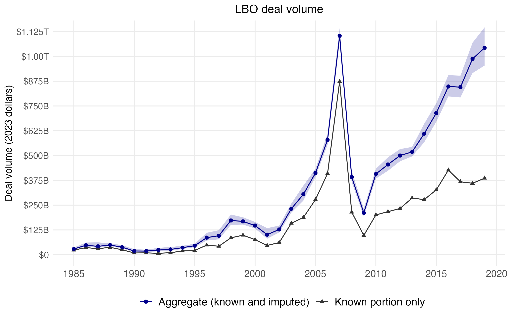

```{r setup, include=FALSE}
knitr::opts_chunk$set(echo = TRUE)

library(tidyverse)
library(gt)
library(gtsummary) #(publication ready tables)
library(haven)
library(here)
library(ggeffects)
library(cowplot)
library(mice)
library(miceadds)
library(data.table)
library(patchwork)
library(scales)
library(priceR)   # CPI inflation adjustment (analogous to Python `cpi`)
library(zoo)      # rollmean
library(blscrapeR)   # BLS API client
```

# Figure 3 (log-space pooling)

```{r}
imp <- readRDS("imputed_data_nopubliccap.Rds")
imp_all <- complete(imp, "all")
```

```{r}
datlist <- miceadds::mids2datlist(imp) 
M       <- length(datlist)

orig    <- as.data.table(complete(imp, 0)) # original data with NA
orig[, is_mis := is.na(dealsize_2023d)]

## Known (non-missing) yearly totals: fixed, no uncertainty
known_year <- orig[!is.na(dealsize_2023d),
  .(known_volume = sum(dealsize_2023d, na.rm = TRUE)),
  by = dealyear
]

## Imputed-only yearly totals for each dataset
mis_index <- is.na(orig$dealsize_2023d)
```

```{r}
## 2. Known (non-missing) yearly totals: fixed, no uncertainty
known_year_log <- orig[!is.na(dealsize_2023d),
  .(known_volume = sum(dealsize_2023d, na.rm = TRUE)),
  by = dealyear
]

## 3. Imputed-only yearly totals for each dataset 
res_mis_log <- rbindlist(
  lapply(seq_along(datlist), function(k) {
    dt <- as.data.table(datlist[[k]])
    dt[, is_mis := mis_index]

    dt[is_mis == TRUE,
       .(m = k,
         Q = sum(dealsize_2023d, na.rm = TRUE)),
       by = dealyear]
  })
)

## 4. Pool imputed totals per year in LOG space ----------------------------
pooled_mis_log <- res_mis_log[
  , {
      log_Q     <- log(Q)
      Q_bar_log <- mean(log_Q)
      B_log     <- var(log_Q)
      n_imp     <- .N
      T_log     <- (1 + 1 / n_imp) * B_log
      se_log    <- sqrt(T_log)
      df        <- n_imp - 1
      t_crit    <- qt(0.975, df = df)

      list(
        mis_volume = exp(Q_bar_log),
        mis_se     = se_log,
        mis_df     = df,
        mis_lower  = exp(Q_bar_log - t_crit * se_log),
        mis_upper  = exp(Q_bar_log + t_crit * se_log)
      )
    },
    by = dealyear
]

## 5. Combine known + imputed to get total yearly volume --------------------
pooled_year_log <- merge(known_year_log, pooled_mis_log, by = "dealyear", all = TRUE)
pooled_year_log[, `:=`(
  volume = known_volume + mis_volume,
  lower  = known_volume + mis_lower,
  upper  = known_volume + mis_upper
)]
setorder(pooled_year_log, dealyear)
pooled_year_log[, `:=`(
  volume_ra3       = frollmean(volume,       n = 3, align = "right"),
  lower_ra3        = frollmean(lower,        n = 3, align = "right"),
  upper_ra3        = frollmean(upper,        n = 3, align = "right"),
  known_volume_ra3 = frollmean(known_volume, n = 3, align = "right")
)]
pooled_year_log <- pooled_year_log[dealyear >= 1985 & dealyear <= 2019]

pooled_year_log
```


Updated Figure 3
```{r}
# Compute shared y-axis limits
y_max <- 1125000
y_min <- 0

p_B <- ggplot(pooled_year_log, aes(x = dealyear)) +
  geom_line(aes(y = known_volume, colour = "Known portion only"),
            na.rm = TRUE) +
  geom_point(aes(y = known_volume, colour = "Known portion only"),
             na.rm = TRUE, shape = 17) +
  geom_ribbon(aes(ymin = lower, ymax = upper),
              alpha = 0.2, fill = "darkblue") +
  geom_line(aes(y = volume, colour = "Aggregate (known and imputed)"),
            na.rm = TRUE) +
  geom_point(aes(y = volume, colour = "Aggregate (known and imputed)"),
             na.rm = TRUE) +
  scale_colour_manual(
    name   = "",
    values = c("Aggregate (known and imputed)" = "darkblue",
               "Known portion only"            = "grey20")) +
  labs(
    y     = "Deal volume (2023 dollars)",
    title = "LBO deal volume") +
  scale_y_continuous(
    breaks = c(0, 0.125, 0.25, 0.375, 0.50, 0.625, 0.75, 0.875, 1, 1.125) * 1e6,
    labels = c("$0", "$125B", "$250B", "$375B", "$500B",
               "$625B", "$750B", "$875B", "$1.00T", "$1.125T")) +
  scale_x_continuous(
     breaks = c(1985, 1990, 1995, 2000, 2005, 2010, 2015, 2020)
    )+
  coord_cartesian(ylim = c(y_min, y_max)) +
  theme_minimal() +
  theme(legend.position    = "bottom",
        panel.grid.minor = element_blank(),
        axis.title.x       = element_blank(),
        legend.text        = element_text(size = 12),
        plot.title         = element_text(size = 13, hjust = 0.5),
        plot.title.position = "panel",
        axis.title.y       = element_text(size = 11),
        axis.text.x        = element_text(size = 11),
        axis.text.y        = element_text(size = 10))

ggsave("figures/f3_lbo_deal_volume.png", p_B,
       width = 8, height = 5, units = "in", dpi = 320)

```