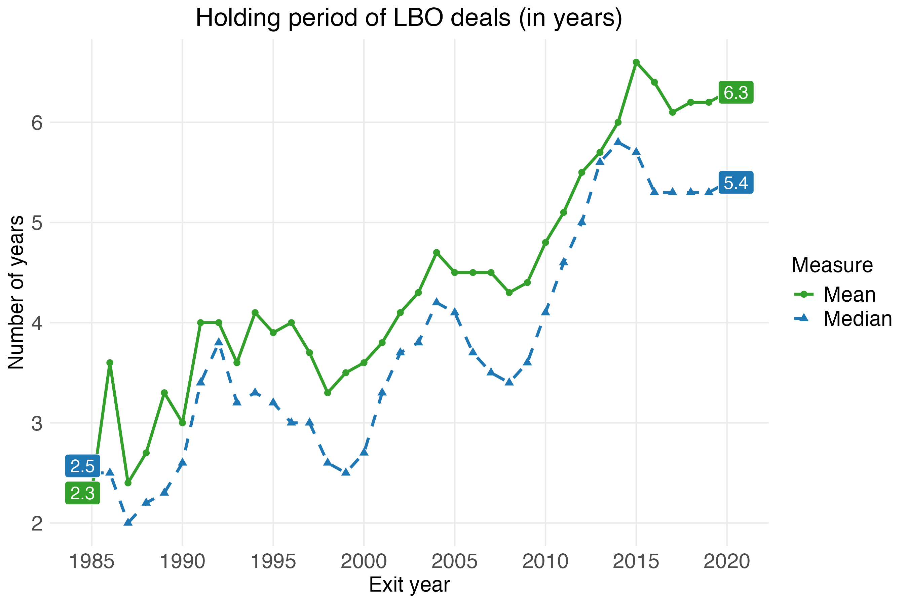

```{r message = FALSE, warning = FALSE}
library(tidyverse)
library(slider)
library(scales)
```


Figure 8 - holding period
```{r}
buyout_exits_status <- readRDS("buyout_exits_status.RDS")

holding_period <- buyout_exits_status %>% 
  filter(exit_type != "") %>% 
  filter(exit_year > 1984, exit_year < 2021) %>% 
  group_by(exit_year) %>% 
  mutate(exit_duration = dealdatenumeric_lead - dealdate_numeric,
         exit_duration_year = exit_year - ml_dealyear) %>% 
  summarise(Mean   = round(mean(exit_duration,   na.rm = TRUE), 1),
            Median = round(median(exit_duration, na.rm = TRUE), 1)) %>% 
  pivot_longer(cols = c("Mean", "Median"), names_to = "Measure", values_to = "value") %>% 
  mutate(label = ifelse(exit_year == 1985 | exit_year == 2020, value, NA),
         label_x = ifelse(exit_year == 1985, 1984.5,
                   ifelse(exit_year == 2020, 2020.5, NA)),
         label_y = ifelse(exit_year == 1985 & Measure == "Median", 2.57, value)) %>% 
                   #ifelse(exit_year == 2021 & Measure == "Median", 6.93, value))) %>% 
  #mutate(label = ifelse(exit_year == 2020 & Measure == "Median", "5.4", label)) %>% 
  ggplot() +
  geom_line(aes(color = Measure, linetype = Measure, x = exit_year, y = value), size = 1) +
  geom_point(aes(color = Measure, shape = Measure, x = exit_year, y = value), size = 2) +
   scale_x_continuous(
     breaks = c(1985, 1990, 1995, 2000, 2005, 2010, 2015, 2020)
    )+
  scale_color_manual(
    values = c("Mean"   = "#33A02C",
               "Median" = "#1F78B4")) +
  scale_linetype_manual(
    values = c("Mean"   = "solid",
               "Median" = "dashed")) +
  scale_shape_manual(
    values = c("Mean"   = 16,
               "Median" = 17)) +
  scale_fill_manual(
    values = c("Mean"   = "#33A02C",
               "Median" = "#1F78B4")) +
  geom_label(aes(x = label_x, y = label_y, label = label, fill = Measure), color = "white", size = 4.5,
             show.legend = FALSE) +
  labs(title    = "Holding period of LBO deals (in years)",
       x        = "Exit year",
       y        = "Number of years",
       color    = "Measure",
       linetype = "Measure",
       shape    = "Measure") +
  theme_minimal() +
  theme(legend.position  = "right",
        axis.title.x     = element_text(size = 15),
        axis.title.y     = element_text(size = 15),
        plot.title       = element_text(hjust = 0.5, size = 18),
        strip.text       = element_text(size = 15),
        axis.text.x      = element_text(size = 15),
        axis.text.y      = element_text(size = 15),
        legend.text      = element_text(size = 15),
        legend.title     = element_text(size = 15),
        panel.grid.minor = element_blank())

ggsave("figures/f8_holding_periods.png", holding_period, height = 6, width = 9)

```