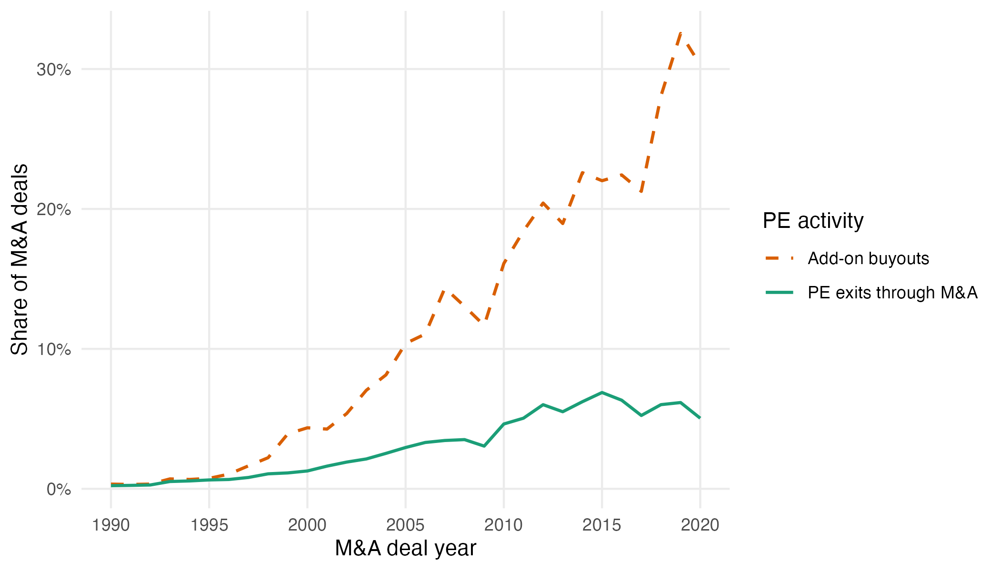

```{r message = FALSE, warning = FALSE}
library(tidyverse)
library(data.table)
library(lubridate)
```


Load PitchBook & Refinitiv data
```{r}
companies <- fread("allcompanies.csv")
deals <- fread("alldeals.csv")
ma <- read.csv("refinitiv_MA_totalcounts.csv")
```


Figure 9 - PE activity as a share of all M&A deals (Refinitiv) 
```{r}
deals_companies <- left_join(deals, companies, by = "companyid")

deals_parsed <- deals_companies %>%
  filter(hd_hqcountry == "UNITED STATES") %>%
  mutate(dealdate = ymd(dealdate),
         dealdate_numeric = year(dealdate) + (month(dealdate)-1)/12 + (day(dealdate)-1)/365)

company_buyouts <- deals_parsed %>%
  group_by(companyid, companyname) %>%
  summarise(
    number_buyouts = sum(dealtype == "Buyout/LBO", na.rm = TRUE),
    first_buyout_date = if_else(number_buyouts > 0,
                                min(dealdate_numeric[dealtype == "Buyout/LBO"], na.rm = TRUE),
                                NA_real_),
    .groups = "drop"
  )

buyout <- deals_parsed %>%
  left_join(company_buyouts, by = c("companyid", "companyname")) %>%
  filter(number_buyouts > 0) %>%
  arrange(companyid, dealdate) %>%            # optional: ensure ordering for deal numbers
  group_by(companyid, companyname) %>%
  mutate(deal_number = row_number(dealdate)) %>%
  ungroup() %>%
  mutate(
    before_buyout = as.integer(dealdate_numeric < first_buyout_date),
    after_buyout  = as.integer(dealdate_numeric > first_buyout_date)
  )

MA_exits <- buyout %>% 
  filter(after_buyout == 1 | dealtype == "Buyout/LBO") %>% 
  filter(dealtype == "Corporate" | dealtype == "Corporate Asset Purchase" | dealtype == "Merger of Equals" | 
           dealtype == "Merger/Acquisition" | dealtype == "Reverse Merger" ) %>% 
  mutate(dealtype_ = case_when(dealtype == "Corporate" ~ "M&A",
                               dealtype == "Corporate Asset Purchase" ~ "M&A",
                               dealtype == "Merger of Equals" ~ "M&A",
                               dealtype == "Merger/Acquisition" ~ "M&A",
                               dealtype == "Reverse Merger" ~ "M&A",
                               TRUE ~ dealtype)) %>% 
  filter(dealtype_ == "M&A") %>% 
  group_by(ml_dealyear) %>% 
  summarise(MA_exit = n())

addon_count <- buyout %>% 
  filter(dealtype == "Buyout/LBO" & addon == "Yes") %>% 
  group_by(ml_dealyear) %>% 
  summarise(LBO_count = n())

combined <- left_join(addon_count, MA_exits, by = "ml_dealyear")

combined <- left_join(combined, ma, by = c("ml_dealyear" = "year_completed"))

MA_activity <- combined %>% 
  mutate(PE_exits_PitchBook = MA_exit/total_MA_refinitiv,
         PE_deals_PitchBook = LBO_count/total_MA_refinitiv) %>% 
  pivot_longer(cols = c(PE_exits_PitchBook, PE_deals_PitchBook), 
               names_to = "variable", values_to = "measure") %>% 
  mutate(variable = case_when(variable == "PE_exits_PitchBook" ~ "PE exits through M&A",
                              variable == "PE_deals_PitchBook" ~ "Add-on buyouts",
                              TRUE ~ NA)) %>% 
  filter(ml_dealyear > 1984, ml_dealyear < 2021) %>% 
  ggplot(aes(x = ml_dealyear, y = measure,
             color = variable, linetype = variable, shape = variable)) +
  geom_line(size = 0.75) +
  scale_x_continuous(
     breaks = c(1990, 1995, 2000, 2005, 2010, 2015, 2020),
     limits = c(1990, 2020)
    )+
  scale_color_manual(
    values = c("PE exits through M&A" = "#1B9E77",
               "Add-on buyouts"       = "#D95F02")) +
  scale_linetype_manual(
    values = c("PE exits through M&A" = "solid",
               "Add-on buyouts"       = "dashed")) +
  scale_shape_manual(
    values = c("PE exits through M&A" = 16,
               "Add-on buyouts"       = 17)) +
  scale_y_continuous(labels = scales::percent_format(accuracy = 1),
                     breaks = seq(0, 1, by = 0.1)) +
  labs(x        = "M&A deal year",
       y        = "Share of M&A deals",
       color    = "PE activity",
       linetype = "PE activity",
       shape    = "PE activity") +
  theme_minimal() +
  theme(panel.grid.minor = element_blank())

ggsave("figures/f9_ma_shares.png", MA_activity, height = 4, width = 7)

```
