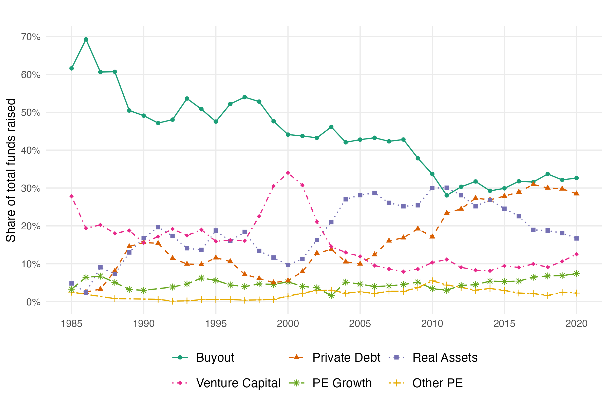

```{r setup, include=FALSE}
library(scales)
library(blscrapeR)
library(gt)
library(tidyverse)
library(data.table)

knitr::opts_chunk$set(echo = TRUE)
```


Import data
```{r}
path <- "PitchBook_Pivot_US_Funds.csv"
```


Prep the data
```{r}
# --- Import + basic cleaning ---
funds <- read_csv(path, show_col_types = FALSE) %>%
  dplyr::select(1:12) %>%
  filter(!(`Closed Year` %in% c("2024", "2025"))) %>%
  mutate(across(everything(), as.character))

value_cols <- names(funds)[4:ncol(funds)]

clean_num <- function(x) {
  x <- str_replace_all(x, "[^0-9.\\-]", "")
  x[x %in% c("", "-")] <- NA_character_
  as.numeric(x)
}

funds <- funds %>%
  mutate(across(all_of(value_cols), clean_num))

# --- Build data2 ---
todrop <- c(
  "Fund Size Mean", "Fund Size Median", "Fund Size Max",
  "Fund Size Min", "Fund Size 25th", "Fund Size 75th"
)
value_cols <- c("Fund Count", "Fund Size Sum", "Fund Size Count")

data2 <- funds %>%
  filter(`Fund Category` != "All", `Closed Year` != "All") %>%
  mutate(`Closed Year` = as.integer(`Closed Year`)) %>%
  filter(`Closed Year` >= 1980) %>%
  arrange(`Closed Year`, `Fund Category`, `Fund Type`) %>%
  select(-any_of(todrop))

# Keep only the "All" rollup for these categories (drop their subtypes)
data2 <- data2 %>%
  filter((`Fund Category` != "Venture Capital") | (`Fund Type` == "All")) %>%
  filter((`Fund Category` != "Debt")            | (`Fund Type` == "All")) %>%
  filter((`Fund Category` != "Real Assets")     | (`Fund Type` == "All"))

# Drop the standalone "Other" category entirely
data2 <- data2 %>%
  filter(`Fund Category` != "Other")

# Merge only the two minor PE subtypes into "Other PE Funds"
other_pe <- c("Diversified Private Equity", "Restructuring/Turnaround")

data2 <- data2 %>%
  mutate(`Fund Type` = if_else(`Fund Type` %in% other_pe, "Other PE Funds", `Fund Type`)) %>%
  mutate(across(all_of(value_cols), ~ replace_na(.x, 0))) %>%
  group_by(`Closed Year`, `Fund Category`, `Fund Type`) %>%
  summarise(across(all_of(value_cols), ~ sum(.x, na.rm = TRUE)), .groups = "drop") %>%
  filter(!(`Fund Category` == "Private Equity" & `Fund Type` == "All")) %>%
  mutate(
    category = if_else(`Fund Category` == "Private Equity", `Fund Type`, `Fund Category`)
  ) %>%
  select(`Closed Year`, category, all_of(value_cols))

# Final relabeling — no "Other Funds" bucket
replacements <- c(
  "Debt"             = "Private Debt",
  "Buyout"           = "Buyout",
  "Growth/Expansion" = "PE Growth",
  "Other PE Funds"   = "Other PE",
  "Venture Capital"  = "Venture Capital",
  "Real Assets"      = "Real Assets"
)

data2 <- data2 %>%
  mutate(category = recode(category, !!!replacements))
```


Appendix 1
```{r}
plot2_df <- data2 %>%
  select(`Closed Year`, category, `Fund Size Sum`) %>%
  group_by(category) %>%
  arrange(`Closed Year`, .by_group = TRUE) %>%
  mutate(
    roll3_fund_size = rowMeans(
      cbind(lag(`Fund Size Sum`), lead(`Fund Size Sum`), `Fund Size Sum`),
      na.rm = TRUE
    )
  ) %>%
  ungroup() %>%
  group_by(`Closed Year`) %>%
  mutate(
    total_roll3 = sum(roll3_fund_size, na.rm = TRUE),
    share       = roll3_fund_size / total_roll3
  ) %>%
  ungroup() %>%
  filter(`Closed Year` >= 1985, `Closed Year` <= 2020)

# --- Order legend to match the final (most recent) line ordering ---
cat_order <- plot2_df %>%
  group_by(category) %>%
  slice_max(`Closed Year`, n = 1, with_ties = FALSE) %>%
  ungroup() %>%
  arrange(desc(share)) %>%
  pull(category)

plot2_df <- plot2_df %>%
  mutate(category = factor(category, levels = cat_order))

p2 <- ggplot(plot2_df, aes(x = `Closed Year`, y = share,
                            color = category, linetype = category, shape = category)) +
  geom_line() +
  geom_point() +
  labs(
    title = "",
    x     = NULL,
    y     = "Share of total funds raised"
  ) +
  theme_minimal() +
  theme(
    plot.caption    = element_text(hjust = 0.5),
    legend.position = "bottom",
    legend.title    = element_blank()
  ) +
  scale_y_continuous(
    labels = scales::percent_format(accuracy = 1),
    breaks = seq(0, 1, by = 0.1)
  ) +
  scale_linetype_manual(
    values = c("solid", "dashed", "dotted", "dotdash", "longdash", "twodash")[seq_along(unique(plot2_df$category))]
  ) +
  scale_shape_manual(
    values = c(16, 17, 15, 18, 8, 3)[seq_along(unique(plot2_df$category))]
  ) +
  guides(
    color    = guide_legend(nrow = 2, byrow = TRUE),
    linetype = guide_legend(nrow = 2, byrow = TRUE),
    shape    = guide_legend(nrow = 2, byrow = TRUE)
  )+
  scale_x_continuous(
     breaks = c(1985, 1990, 1995, 2000, 2005, 2010, 2015, 2020)
    )+
  theme(legend.text = element_text(size = 11),
        panel.grid.minor = element_blank())

ggsave("figures/fa1_funds_raised_shares.png", p2 + scale_color_brewer(palette = "Dark2"),
       width = 7.5, height = 5, units = "in", dpi = 320)

```
