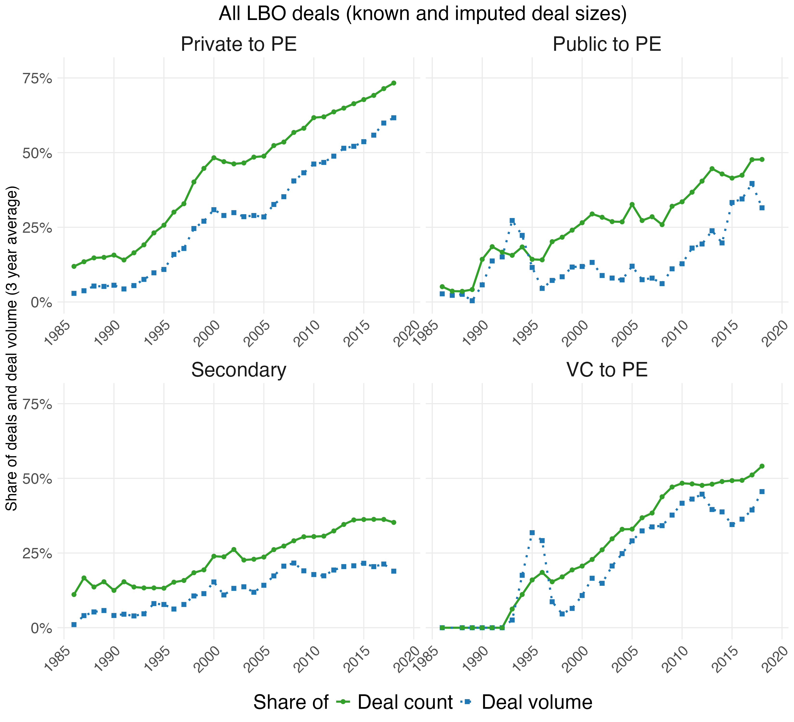
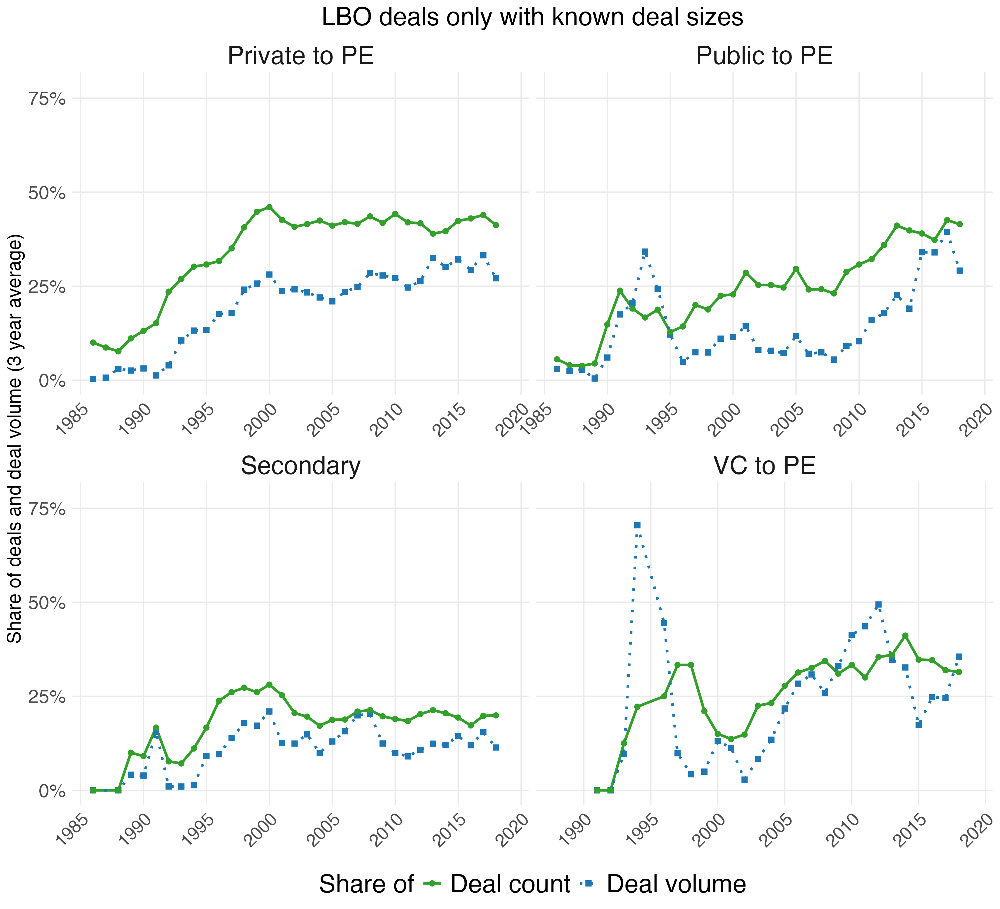

```{r message = FALSE, warning = FALSE}
library(tidyverse)
library(data.table)
library(slider)
```


Load imputed LBO data
```{r}
imp_obj <- readRDS("imputed_data_nopubliccap.Rds")

# Original data (with NAs)
orig <- as.data.table(imp_obj$data)

# Row indices where variables were missing
mis_dealsize <- which(imp_obj$where[, "dealsize_2023d"])
# Extract imputed matrix
imp_reg      <- as.data.table(imp_obj$imp$dealsize_2023d)

setnames(
  imp_reg,
  old  = names(imp_reg),
  new  = paste0("imp", seq_along(imp_reg))
)


# Attach row indices and dealid
dt_reg <- data.table(
  row = mis_dealsize,
  imp_reg
)

dt_reg[, dealid := orig$dealid[row]]

# Compute mean ONLY across imputations (one mean per dealid, only where missing originally)

means_dealsize <- dt_reg[
  , .(dealsize_2023d_imputed = rowMeans(.SD, na.rm = TRUE)),
  by = dealid,
  .SDcols = patterns("^imp")
]

# Merge into the original file
buyout_deals_imputed <- left_join(orig, means_dealsize, by = "dealid")

buyout_deals_imputed <- buyout_deals_imputed %>% 
  mutate(dealsize_2023d_all = ifelse(!is.na(dealsize_2023d), dealsize_2023d, dealsize_2023d_imputed)) %>% 
  mutate(known_deal_size = ifelse(!is.na(dealsize_2023d), "known", "imputed"))
```


Figure A4 - Add ons by deal type (known and imputed)
```{r}
addons_base <- buyout_deals_imputed %>%
  filter(!is.na(dealyear)) %>%
  group_by(dealyear, transfertype, addon) %>%
  summarise(
    count = n(),
    deal_size = sum(dealsize_2023d_all, na.rm = TRUE) / 1e6,
    .groups = "drop"
  ) %>%
  group_by(dealyear, transfertype) %>%
  mutate(
    count_total = sum(count, na.rm = TRUE),
    deal_size_total = sum(deal_size, na.rm = TRUE)
  ) %>%
  ungroup() %>%
  filter(addon == 0) %>%
  arrange(dealyear) %>%
  group_by(transfertype) %>%
  mutate(
    rolling_count = slide_dbl(count, mean, .before = 1, .after = 1, .complete = TRUE),
    rolling_total_count = slide_dbl(count_total, mean, .before = 1, .after = 1, .complete = TRUE),
    rolling_deal_size = slide_dbl(deal_size, mean, .before = 1, .after = 1, .complete = TRUE),
    rolling_volume = slide_dbl(deal_size_total, mean, .before = 1, .after = 1, .complete = TRUE),
    share_volume = (rolling_volume - rolling_deal_size) / rolling_volume,
    share_count  = (rolling_total_count - rolling_count) / rolling_total_count
  ) %>%
  ungroup()

addons_plot <- addons_base %>%
  pivot_longer(
    cols = starts_with("share_"),
    names_to = "variable",
    values_to = "share"
  ) %>%
  mutate(
    variable = ifelse(variable == "share_volume", "Deal volume", "Deal count")
  ) %>%
  filter(dealyear >= 1986, dealyear <= 2020)

addons <- ggplot(addons_plot, aes(x = dealyear, y = share,
                                   color = variable, linetype = variable, shape = variable)) +
  geom_line(size = 1) +
  geom_point(size = 2) +
  facet_wrap(~ transfertype, scales = "free_x") +
  scale_color_manual(
    values = c("#33A02C", "#1F78B4")) +
  scale_linetype_manual(
    values = c("solid", "dotted")) +
  scale_shape_manual(
    values = c(16, 15)) +
  scale_y_continuous(
    labels = scales::percent_format(accuracy = 1),
    breaks = seq(0, 1, 0.25),
    limits = c(0, 0.78)) +
  scale_x_continuous(breaks = c(1985, 1990, 1995, 2000, 2005, 2010, 2015, 2020)) +
  labs(
    y        = "Share of deals and deal volume (3 year average)",
    title    = "All LBO deals (known and imputed deal sizes)",
    color    = "Share of",
    linetype = "Share of",
    shape    = "Share of") +
  theme_minimal() +
  theme(legend.position  = "bottom",
        panel.background = element_rect(fill = "white", colour = NA),
        plot.background  = element_rect(fill = "white", colour = NA),
        axis.title.x     = element_blank(),
        axis.title.y     = element_text(size = 15),
        axis.text.x      = element_text(size = 14, angle = 45, hjust = 1),
        axis.text.y      = element_text(size = 15),
        plot.title       = element_text(size = 20, hjust = 0.5),
        legend.text      = element_text(size = 20),
        legend.title     = element_text(size = 20),
        strip.text       = element_text(size = 20),
        panel.grid.minor = element_blank())

ggsave("figures/fa4_addon_shares_alldeals.png", addons, height = 10, width = 11)

```


Figure A4 - Add ons by deal type (known only)
```{r}
addons_base <- buyout_deals_imputed %>%
  filter(!is.na(dealyear)) %>%
  filter(known_deal_size == "known") %>%
  group_by(dealyear, transfertype, addon) %>%
  summarise(
    count = n(),
    deal_size = sum(dealsize_2023d_all, na.rm = TRUE) / 1e6,
    .groups = "drop"
  ) %>%
  group_by(dealyear, transfertype) %>%
  mutate(
    count_total = sum(count, na.rm = TRUE),
    deal_size_total = sum(deal_size, na.rm = TRUE)
  ) %>%
  ungroup() %>%
  filter(addon == 0) %>%
  arrange(dealyear) %>%
  group_by(transfertype) %>%
  mutate(
    rolling_count = slide_dbl(count, mean, .before = 1, .after = 1, .complete = TRUE),
    rolling_total_count = slide_dbl(count_total, mean, .before = 1, .after = 1, .complete = TRUE),
    rolling_deal_size = slide_dbl(deal_size, mean, .before = 1, .after = 1, .complete = TRUE),
    rolling_volume = slide_dbl(deal_size_total, mean, .before = 1, .after = 1, .complete = TRUE),
    share_volume = (rolling_volume - rolling_deal_size) / rolling_volume,
    share_count  = (rolling_total_count - rolling_count) / rolling_total_count
  ) %>%
  ungroup()

addons_plot <- addons_base %>%
  pivot_longer(
    cols = starts_with("share_"),
    names_to = "variable",
    values_to = "share"
  ) %>%
  mutate(
    variable = ifelse(variable == "share_volume", "Deal volume", "Deal count")
  ) %>%
  filter(dealyear >= 1986, dealyear <= 2020)

addons_ <- ggplot(addons_plot, aes(x = dealyear, y = share,
                                   color = variable, linetype = variable, shape = variable)) +
  geom_line(size = 1) +
  geom_point(size = 2) +
  facet_wrap(~ transfertype, scales = "free_x") +
  scale_color_manual(
    values = c("#33A02C", "#1F78B4")) +
  scale_linetype_manual(
    values = c("solid", "dotted")) +
  scale_shape_manual(
    values = c(16, 15)) +
  scale_y_continuous(
    labels = scales::percent_format(accuracy = 1),
    breaks = seq(0, 1, 0.25),
    limits = c(0, 0.78)) +
  scale_x_continuous(breaks = c(1985, 1990, 1995, 2000, 2005, 2010, 2015, 2020)) +
  labs(
    y        = "Share of deals and deal volume (3 year average)",
    title    = "LBO deals only with known deal sizes",
    color    = "Share of",
    linetype = "Share of",
    shape    = "Share of") +
  theme_minimal() +
  theme(legend.position  = "bottom",
        panel.background = element_rect(fill = "white", colour = NA),
        plot.background  = element_rect(fill = "white", colour = NA),
        axis.title.x     = element_blank(),
        axis.title.y     = element_text(size = 15),
        axis.text.x      = element_text(size = 14, angle = 45, hjust = 1),
        axis.text.y      = element_text(size = 15),
        plot.title       = element_text(size = 20, hjust = 0.5),
        legend.text      = element_text(size = 20),
        legend.title     = element_text(size = 20),
        strip.text       = element_text(size = 20),
        panel.grid.minor = element_blank())

ggsave("figures/fa4_addon_shares_knownsize.png", addons_, height = 10, width = 11)

```