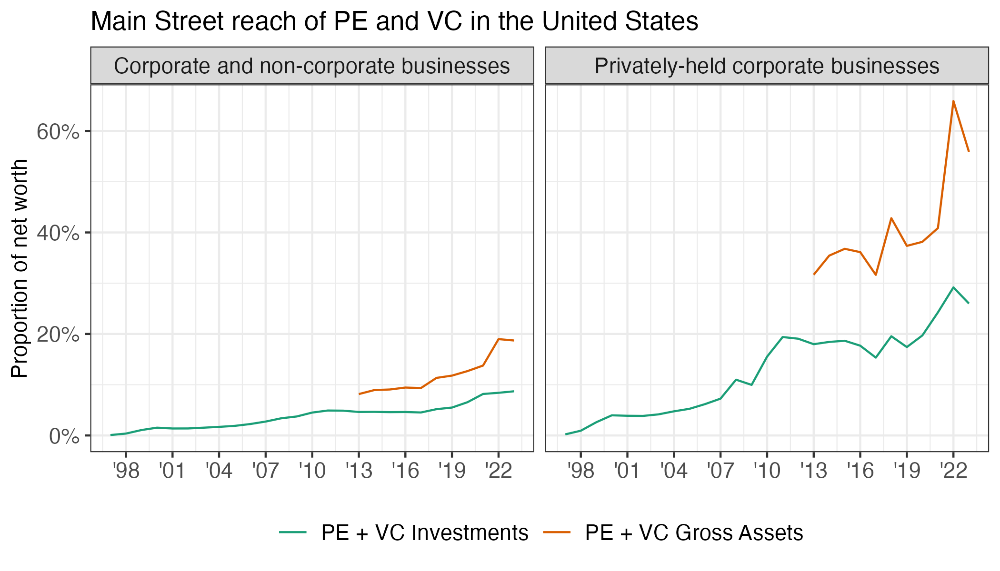

```{r message = FALSE, warning = FALSE}
library(tidyverse)
library(readxl)
library(data.table)
```


Load files
```{r}
data <- read.csv("Networth_Data.csv")
```


Figure A5
```{r}
combined <- data %>% 
  filter(Year>1996) %>% 
  select(Pitchbook_PE_VC_AUM, Pitchbook_PE_VC_Inv, SEC_GAV, ADV_PE_VC_All_Funds, ADV_PE_VC_Advised_by_RIA, Networth_Nonfinance_H, Networth_Nonfinance_Private_H, Networth_Corporate_Nonfinance_Private_H, Year) %>%
  mutate(
    Eq_Nonfinance_and_Pitchbook_Inv_pct = Pitchbook_PE_VC_Inv/Networth_Nonfinance_H,
    Eq_Nonfinance_and_PF_pct = SEC_GAV/Networth_Nonfinance_H,
    Eq_Corporate_and_Pitchbook_Inv_pct = Pitchbook_PE_VC_Inv/Networth_Corporate_Nonfinance_Private_H,
    Eq_Corporate_and_PF_pct = SEC_GAV/Networth_Corporate_Nonfinance_Private_H) %>% 
  pivot_longer(
    cols = starts_with("Eq_"),
    names_to = "Variable",
    values_to = "Amount") %>% 
  select(Year, Variable, Amount) %>% 
  separate(Variable, c("Denominator", "Numerator"), sep = "_and_") %>% 
  mutate(Denominator = ifelse(Denominator == "Eq_Nonfinance", "Corporate and non-corporate businesses",
                       ifelse(Denominator == "Eq_Corporate", "Privately-held corporate businesses", NA))) %>% 
  mutate(Numerator = ifelse(Numerator == "Pitchbook_Inv_pct", "PE + VC Investments",
                     ifelse(Numerator == "PF_pct", "PE + VC Gross Assets",NA))) %>% 
  mutate(Numerator = as.factor(Numerator),
         Denominator = as.factor(Denominator)) %>% 
  mutate(Numerator = fct_relevel(Numerator, "PE + VC Investments", "PE + VC Gross Assets")) %>% 
  mutate(Denominator = fct_relevel(Denominator, "Corporate and non-corporate businesses", "Privately-held corporate businesses")) %>% 
  mutate(Year =  as.Date(paste0(Year, "-01-01"))) %>% 
  ggplot(aes(x = Year, y = Amount, color = Numerator))+
  geom_line()+
  facet_wrap(~ Denominator)+
  theme_bw()+
  theme(legend.text = element_text(size = 11),
        legend.position = "bottom",
        axis.title.x = element_blank(),
        axis.title.y = element_text(size = 11),
        axis.text.y = element_text(size = 11),
        axis.text.x = element_text(size = 11),
        legend.title = element_blank(),
        strip.text = element_text(size = 11))+
  #scale_x_continuous(breaks=c(2006, 2009, 2012, 2015, 2018, 2021))+
  scale_x_date(date_breaks = "3 year", date_labels = "'%y") +
  scale_y_continuous(labels = scales::percent_format(accuracy = 1), limits = c(0,NA))+
  scale_color_brewer(palette = "Dark2")+
  guides(color = guide_legend(nrow = 1))+
  labs(y = "Proportion of net worth",
       color = "",
       title = "Main Street reach of PE and VC in the United States")

ggsave(plot = combined, "figures/fa5_pe_vc_net_worth_shares.png", height = 4, width = 7)

```
