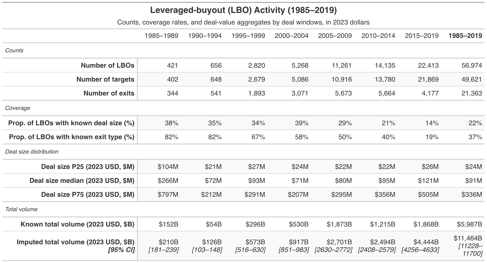

```{r setup, include=FALSE}
knitr::opts_chunk$set(echo = TRUE)
library(tidyverse)
library(data.table)
library(mice)
library(gt)
```


```{r}
imp <- readRDS("imputed_data_nopubliccap.Rds")
imp_all <- complete(imp, "all")
```


```{r}
datlist <- miceadds::mids2datlist(imp) 
M       <- length(datlist)

orig    <- as.data.table(complete(imp, 0)) # original data with NA
orig[, is_mis := is.na(dealsize_2023d)]

## Known (non-missing) yearly totals: fixed, no uncertainty
known_year <- orig[!is.na(dealsize_2023d),
  .(known_volume = sum(dealsize_2023d, na.rm = TRUE)),
  by = dealyear
]

## Imputed-only yearly totals for each dataset
mis_index <- is.na(orig$dealsize_2023d)
```

```{r}
## 2. Known (non-missing) yearly totals: fixed, no uncertainty
known_year_log <- orig[!is.na(dealsize_2023d),
  .(known_volume = sum(dealsize_2023d, na.rm = TRUE)),
  by = dealyear
]

## 3. Imputed-only yearly totals for each dataset 
res_mis_log <- rbindlist(
  lapply(seq_along(datlist), function(k) {
    dt <- as.data.table(datlist[[k]])
    dt[, is_mis := mis_index]

    dt[is_mis == TRUE,
       .(m = k,
         Q = sum(dealsize_2023d, na.rm = TRUE)),
       by = dealyear]
  })
)

## 4. Pool imputed totals per year in LOG space ----------------------------
pooled_mis_log <- res_mis_log[
  , {
      log_Q     <- log(Q)
      Q_bar_log <- mean(log_Q)
      B_log     <- var(log_Q)
      n_imp     <- .N
      T_log     <- (1 + 1 / n_imp) * B_log
      se_log    <- sqrt(T_log)
      df        <- n_imp - 1
      t_crit    <- qt(0.975, df = df)

      list(
        mis_volume = exp(Q_bar_log),
        mis_se     = se_log,
        mis_df     = df,
        mis_lower  = exp(Q_bar_log - t_crit * se_log),
        mis_upper  = exp(Q_bar_log + t_crit * se_log)
      )
    },
    by = dealyear
]

## 5. Combine known + imputed to get total yearly volume --------------------
pooled_year_log <- merge(known_year_log, pooled_mis_log, by = "dealyear", all = TRUE)
pooled_year_log[, `:=`(
  volume = known_volume + mis_volume,
  lower  = known_volume + mis_lower,
  upper  = known_volume + mis_upper
)]
setorder(pooled_year_log, dealyear)
pooled_year_log[, `:=`(
  volume_ra3       = frollmean(volume,       n = 3, align = "right"),
  lower_ra3        = frollmean(lower,        n = 3, align = "right"),
  upper_ra3        = frollmean(upper,        n = 3, align = "right"),
  known_volume_ra3 = frollmean(known_volume, n = 3, align = "right")
)]
pooled_year_log <- pooled_year_log[dealyear >= 1985 & dealyear <= 2019]

pooled_year_log
```


# LBO stats (Table 1)

exporting exit stats
```{r}
exit_dt <-readRDS("buyout_exits_status.RDS")
# IDate columns saved with double storage are rejected by newer vctrs; convert them to Date
for (col in names(exit_dt)[vapply(exit_dt, inherits, logical(1), "IDate")]) {
  exit_dt[[col]] <- as.Date(as.numeric(exit_dt[[col]]))
}

exit_dt <- exit_dt %>% 
  rename(dealyear = ml_dealyear)

exit_dt <- as.data.table(exit_dt)

# keep just the keys needed to align with orig; adjust key col if not companyid+dealyear
orig[exit_dt, on = .(companyid, dealyear), exit_type := i.exit_type]
```


```{r}
lbo_period_bucket <- function(y) {
  fcase(
    y < 1985, "Before 1985",
    y >= 1985 & y < 1990, "1985–1989",
    y >= 1990 & y < 1995, "1990–1994",
    y >= 1995 & y < 2000, "1995–1999",
    y >= 2000 & y < 2005, "2000–2004",
    y >= 2005 & y < 2010, "2005–2009",
    y >= 2010 & y < 2015, "2010–2014",
    y >= 2015 & y < 2020, "2015–2019",
    y >= 2020 & y < 2025, "2020–2023"
  )
}

lvls <- c(
  "Before 1985","1985–1989","1990–1994","1995–1999",
  "2000–2004","2005–2009","2010–2014","2015–2019",
  "2020–2023"
)

orig[, lbo_period := lbo_period_bucket(dealyear)]
orig[, lbo_period := factor(
  lbo_period,
  levels = lvls
)]
```


```{r}
datlist <- lapply(datlist, function(d) {
  setDT(d)  
  d[, lbo_period := factor(lbo_period_bucket(dealyear), levels = lvls)]
  d
})
```


```{r}
sum_known <- orig[dealyear >= 1985 & dealyear < 2020, .(
  lbo_count = .N,
  target_count = uniqueN(companyid),
  exit_count = sum(!is.na(exit_type)),
  pct_kn = round((.N - sum(is_mis)) / .N, digits = 2),
  pct_kn_exit = round(sum(!is.na(exit_type)) / .N, digits = 2),
  p25_size_mn = round(quantile(dealsize_2023d, probs = c(0.25), na.rm = T), digits = 0),
  med_size_mn = round(quantile(dealsize_2023d, probs = c(0.5), na.rm = T), digits = 0),
  p75_size_mn = round(quantile(dealsize_2023d, probs = c(0.75), na.rm = T), digits = 0),
  vol_kn_bn = round(sum(dealsize_2023d, na.rm = T) / 1e3, digits = 0)
), by = lbo_period][order(lbo_period)]
```

```{r}
## 2. Known (non-missing) period totals: fixed, no uncertainty -------------
known_year <- orig[!is.na(dealsize_2023d) & dealyear >= 1985 & dealyear < 2020,
  .(known_volume = sum(dealsize_2023d, na.rm = TRUE)),
  by = lbo_period
][order(lbo_period)]

## 3. Imputed-only period totals for each dataset --------------------------
mis_index <- is.na(orig$dealsize_2023d)
res_mis <- rbindlist(
  lapply(seq_along(datlist), function(k) {
    dt <- as.data.table(datlist[[k]])
    # align missingness pattern with original rows
    dt[, is_mis := mis_index]

    dt[is_mis == TRUE & dealyear >= 1985 & dealyear < 2020,
       .(m = k,
         Q = sum(dealsize_2023d, na.rm = TRUE),
         U = 0),
       by = lbo_period][order(lbo_period)]
  })
)

## 4. Pool imputed totals per year using Rubin's rules ----------------------
pooled_mis <- res_mis[
  , {
      ps     <- pool.scalar(Q = Q, U = U)  # Rubin’s rules for scalar
      se     <- sqrt(ps$t)
      t_crit <- qt(0.975, df = ps$df)

      # CI for imputed part; lower bound truncated at 0 (cannot be negative)
      mis_lower <- pmax(0, ps$qbar - t_crit * se)
      mis_upper <- ps$qbar + t_crit * se

      list(
        mis_volume = ps$qbar,
        mis_se     = se,
        mis_df     = ps$df,
        mis_lower  = mis_lower,
        mis_upper  = mis_upper
      )
    },
    by = lbo_period
]

## 5. Combine known + imputed to get total yearly volume --------------------
pooled_prd <- merge(known_year, pooled_mis, by = "lbo_period", all = TRUE)
pooled_prd[, `:=`(
  volume = known_volume + mis_volume,
  lower  = known_volume + mis_lower,
  upper  = known_volume + mis_upper
)]
setorder(pooled_prd, lbo_period)
```


```{r}
## ---- TOTAL column: known summaries over full span (no period grouping) ----
sum_known_tot <- orig[dealyear >= 1985 & dealyear < 2020, .(
  lbo_period   = "1985–2019",
  lbo_count    = .N,
  target_count = uniqueN(companyid),
  exit_count   = sum(!is.na(exit_type)),
  pct_kn       = round((.N - sum(is_mis)) / .N, digits = 2),
  pct_kn_exit  = round(sum(!is.na(exit_type)) / .N, digits = 2),
  p25_size_mn  = round(quantile(dealsize_2023d, probs = 0.25, na.rm = TRUE), 0),
  med_size_mn  = round(quantile(dealsize_2023d, probs = 0.50, na.rm = TRUE), 0),
  p75_size_mn  = round(quantile(dealsize_2023d, probs = 0.75, na.rm = TRUE), 0),
  vol_kn_bn    = round(sum(dealsize_2023d, na.rm = TRUE) / 1e3, 0)
)]

## ---- TOTAL column: pooled imputed volume over full span -------------------
known_tot <- orig[!is.na(dealsize_2023d) & dealyear >= 1985 & dealyear < 2020,
  .(known_volume = sum(dealsize_2023d, na.rm = TRUE))
]$known_volume

# Each imputation's total imputed-only volume across the whole span
res_mis_tot <- rbindlist(
  lapply(seq_along(datlist), function(k) {
    dt <- as.data.table(datlist[[k]])
    dt[, is_mis := mis_index]
    dt[is_mis == TRUE & dealyear >= 1985 & dealyear < 2020,
       .(m = k, Q = sum(dealsize_2023d, na.rm = TRUE), U = 0)]
  })
)

pooled_mis_tot <- res_mis_tot[, {
  ps     <- pool.scalar(Q = Q, U = U)
  se     <- sqrt(ps$t)
  t_crit <- qt(0.975, df = ps$df)
  list(
    mis_volume = ps$qbar,
    mis_lower  = pmax(0, ps$qbar - t_crit * se),
    mis_upper  = ps$qbar + t_crit * se
  )
}]

pooled_prd_tot <- data.table(
  lbo_period = "1985–2019",
  impvol_bn  = round((known_tot + pooled_mis_tot$mis_volume) / 1e3, 0),
  impCI_bn   = paste0("[",
                      round((known_tot + pooled_mis_tot$mis_lower) / 1e3, 0), "–",
                      round((known_tot + pooled_mis_tot$mis_upper) / 1e3, 0),
                      "]")
)
```


```{r}
lbo_tbl <- rbind(
  cbind(
    sum_known,
    pooled_prd[, .(
      impvol_bn = round(volume / 1e3, digits = 0),
      impCI_bn  = paste0("[",
                         round(lower / 1e3, digits = 0), "–",
                         round(upper / 1e3, digits = 0), "]")
    )]
  ),
  cbind(sum_known_tot, pooled_prd_tot[, .(impvol_bn, impCI_bn)])
)

lbo_tbl
```

```{r}
dcast(melt(lbo_tbl, id.vars = "lbo_period"), variable ~ lbo_period)
```


```{r other direction}
style_lbo_table <- function(lbo_tbl, title, subtitle, ci_label = "95% CI") {

  tbl <- lbo_tbl %>%
    as_tibble() %>%
    mutate(
      lbo_period = as.character(lbo_period),
      # Build a single display column for imputed volume + CI (2-line cell)
      impvol_ci = gt::md(paste0(
        formatC(impvol_bn, format = "f", digits = 0, big.mark = ","),
        "<br><span style='font-size:11px'>", impCI_bn, "</span>"
      ))
    ) %>%
    select(
      lbo_period,
      lbo_count, target_count, exit_count,
      pct_kn,
      p25_size_mn, med_size_mn, p75_size_mn,
      vol_kn_bn,
      impvol_ci
    )

  tbl %>%
    gt(rowname_col = "lbo_period") %>%
    tab_stubhead(label = "Deal window") %>%

    # ---- Title block ----
    tab_header(
      title    = md(paste0("**", title, "**")),
      subtitle = md(subtitle)
    ) %>%

    # ---- Column labels + spanners ----
    cols_label(
      lbo_count    = "LBOs",
      target_count = "Targets",
      exit_count   = "Number of exits",
      pct_kn       = "% size known",
      p25_size_mn  = "P25",
      med_size_mn  = "Median",
      p75_size_mn  = "P75",
      vol_kn_bn    = "Known",
      impvol_ci    = md(paste0("Imputed<br><span style='font-weight:400'>(", ci_label, ")</span>"))
    ) %>%
    tab_spanner("Counts", columns = c(lbo_count, target_count, exit_count)) %>%
    tab_spanner(md("Deal size (2023 USD, $M)"), columns = c(p25_size_mn, med_size_mn, p75_size_mn)) %>%
    tab_spanner(md("Total volume (2023 USD, $B)"), columns = c(vol_kn_bn, impvol_ci)) %>%

    # ---- Formatting ----
    fmt_number(columns = c(lbo_count, target_count),
               decimals = 0, sep_mark = ",") %>%
    fmt_percent(columns = pct_kn, decimals = 0) %>%
    fmt_number(columns = c(p25_size_mn, med_size_mn, p75_size_mn),
               decimals = 0, sep_mark = ",", pattern = "${x}M") %>%
    fmt_number(columns = vol_kn_bn,
               decimals = 0, sep_mark = ",", pattern = "${x}B") %>%
    fmt_markdown(columns = impvol_ci) %>%

    # ---- Layout / aesthetics ----
    cols_align("left", columns = stub()) %>%
    cols_align("right", columns = everything()) %>%
    cols_width(
      stub() ~ px(170),
      c(lbo_count, target_count, exit_count) ~ px(90),
      pct_kn ~ px(110),
      c(p25_size_mn, med_size_mn, p75_size_mn) ~ px(85),
      vol_kn_bn ~ px(95),
      impvol_ci ~ px(140)
    ) %>%
    tab_style(
      style = cell_text(weight = "bold"),
      locations = cells_stub(rows = everything())
    ) %>%
    opt_row_striping() %>%
    opt_table_font(font = list("Helvetica", "Arial", "sans-serif")) %>%
    tab_options(
      table.font.size            = px(13),
      heading.title.font.size    = px(18),
      heading.subtitle.font.size = px(13),
      column_labels.font.size    = px(12),
      data_row.padding           = px(6),
      table.border.top.style     = "solid",
      table.border.bottom.style  = "solid",
      column_labels.border.bottom.style = "solid"
    ) %>%
    tab_source_note(md(
      "Notes: Deal sizes and volumes are in 2023 dollars. Size percentiles are computed on deals with known sizes. Imputed totals are pooled across imputations; confidence intervals reflect imputation uncertainty."
    ))
}

lbo_gt <- style_lbo_table(
  lbo_tbl,
  title    = "Leveraged-Buyout (LBO) Activity (1985–2019)",
  subtitle = "Counts, coverage rates, and deal-value aggregates by deal windows, in 2023 dollars",
  ci_label = "95% CI"
)
lbo_gt

```

```{r}
style_lbo_table_period_cols <- function(lbo_tbl, title, subtitle, ci_label = "95% CI") {

  period_levels <- as.character(lbo_tbl$lbo_period)
  num <- function(x) suppressWarnings(as.numeric(x))
  fmt_int <- function(x) formatC(num(x), format = "f", digits = 0, big.mark = ",")
  fmt_pct <- function(x) paste0(round(num(x) * 100, 0), "%")
  fmt_usd_m <- function(x) paste0("$", fmt_int(x), "M")
  fmt_usd_b <- function(x) paste0("$", fmt_int(x), "B")

  wide <- lbo_tbl %>%
    as_tibble() %>%
    mutate(
      lbo_period = factor(as.character(lbo_period),
                          levels = period_levels, ordered = TRUE),
      impvol_ci = paste0(fmt_usd_b(impvol_bn), "  \n", "*", impCI_bn, "*")
    ) %>%
    select(
      lbo_period, lbo_count, target_count, exit_count, pct_kn, pct_kn_exit,
      p25_size_mn, med_size_mn, p75_size_mn, vol_kn_bn, impvol_ci
    ) %>%
    # make everything character so pivot_longer can combine them
    mutate(across(-lbo_period, as.character)) %>%
    pivot_longer(-lbo_period, names_to = "stat", values_to = "value") %>%
    mutate(
      variable = recode(
        stat,
        lbo_count    = "Number of LBOs",
        target_count = "Number of targets",
        exit_count = "Number of exits",
        pct_kn       = "Prop. of LBOs with known deal size (%)",
        pct_kn_exit  = "Prop. of LBOs with known exit type (%)",
        p25_size_mn  = "Deal size P25 (2023 USD, $M)",
        med_size_mn  = "Deal size median (2023 USD, $M)",
        p75_size_mn  = "Deal size P75 (2023 USD, $M)",
        vol_kn_bn    = "Known total volume (2023 USD, $B)",
        impvol_ci    = paste0("Imputed total volume (2023 USD, $B)  \n*[", ci_label, "]*")
      ),
      group = case_when(
        stat %in% c("lbo_count", "target_count", "exit_count") ~ "Counts",
        stat == "pct_kn"                         ~ "Coverage",
        stat == "pct_kn_exit"                    ~ "Coverage",
        stat %in% c("p25_size_mn", "med_size_mn", "p75_size_mn") ~ "Deal size distribution",
        stat %in% c("vol_kn_bn", "impvol_ci")     ~ "Total volume",
        TRUE                                      ~ "Other"
      ),
      display = case_when(
        stat %in% c("lbo_count", "target_count", "exit_count") ~ fmt_int(value),
        stat == "pct_kn"                         ~ fmt_pct(value),
        stat == "pct_kn_exit"                    ~ fmt_pct(value),
        stat %in% c("p25_size_mn", "med_size_mn", "p75_size_mn") ~ fmt_usd_m(value),
        stat == "vol_kn_bn"                      ~ fmt_usd_b(value),
        stat == "impvol_ci"                      ~ value,  # already HTML (estimate + CI)
        TRUE                                     ~ value
      ),
      variable = factor(
        variable,
        levels = c(
          "Number of LBOs",
          "Number of targets",
          "Number of exits",
          "Prop. of LBOs with known deal size (%)",
          "Prop. of LBOs with known exit type (%)",
          "Deal size P25 (2023 USD, $M)",
          "Deal size median (2023 USD, $M)",
          "Deal size P75 (2023 USD, $M)",
          "Known total volume (2023 USD, $B)",
          paste0("Imputed total volume (2023 USD, $B)  \n*[", ci_label, "]*")
        )
      )
    ) %>%
    arrange(variable) %>%
    select(group, variable, lbo_period, display) %>%
    pivot_wider(names_from = lbo_period, values_from = display)

  period_cols <- setdiff(names(wide), c("group", "variable"))

  wide %>%
    gt(rowname_col = "variable", groupname_col = "group") %>%
    tab_header(
      title    = md(paste0("**", title, "**")), subtitle = md(subtitle)
    ) %>%
    tab_stubhead(label = "") %>%
    fmt_markdown(columns = everything()) %>%     # formats the period columns
    cols_align("left",  columns = stub()) %>%
    cols_align("right", columns = everything()) %>%
    cols_width(
      stub() ~ px(280), everything() ~ px(90)    # period columns
    ) %>%
    tab_style(
      style = cell_text(weight = "bold"), locations = cells_stub()
    ) %>%
    tab_style(
      style = cell_text(style = "italic"), locations = cells_row_groups()
    ) %>% 
    tab_style(
      style = cell_text(weight = "bold"),
      locations = cells_column_labels(columns = "1985–2019")
    ) %>%
    opt_row_striping() %>%
    opt_table_font(font = list("Helvetica", "Arial", "sans-serif")) %>%
    tab_options(
      table.font.size            = px(14),
      heading.title.font.size    = px(18),
      heading.subtitle.font.size = px(14),
      row_group.font.size        = px(12),
      data_row.padding           = px(6),
      column_labels.border.bottom.style = "solid"
    )
}

lbo_gt <- style_lbo_table_period_cols(
  lbo_tbl,
  title    = "Leveraged-buyout (LBO) Activity (1985–2019)",
  subtitle = "Counts, coverage rates, and deal-value aggregates by deal windows, in 2023 dollars",
  ci_label = "95% CI"
)

lbo_gt
```


```{r}
gtsave(lbo_gt, "tables/t1_buyout_summary.docx")
gtsave(lbo_gt, "tables/t1_buyout_summary.png", zoom = 2, expand = 5, vwidth = 8 * 90 + 300)  # 2× DPI

```
