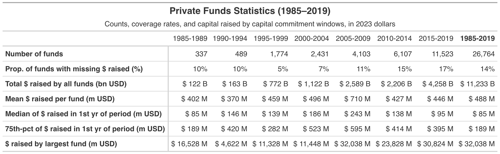
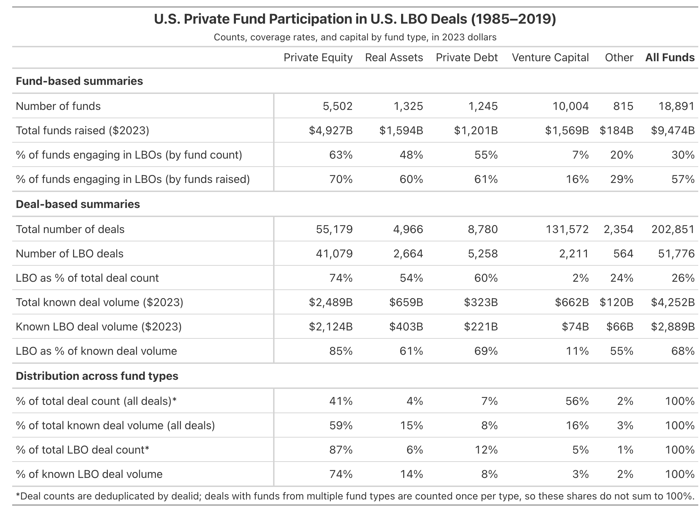

```{r setup, include=FALSE}
library(scales)
library(blscrapeR)
library(gt)
library(tidyverse)
library(data.table)

knitr::opts_chunk$set(echo = TRUE)
```


Appendix Table 1 (top part)
```{r}
# ---- 1. Read pivot, take the All/All top-line rows ----------------
raw <- read_csv("PitchBook_Pivot_US_Funds.csv",
                show_col_types = FALSE)
names(raw) <- str_trim(names(raw))

clean_num <- function(x) {
  x <- str_replace_all(as.character(x), "[^0-9.\\-]", "")
  x[x %in% c("", "-")] <- NA_character_
  as.numeric(x)
}

agg <- raw %>%
  filter(`Fund Category` == "All", `Fund Type` == "All") %>%
  mutate(across(c(`Closed Year`, `Fund Count`, `Fund Size Sum`,
                  `Fund Size Median`, `Fund Size Max`,
                  `Fund Size 75th`, `Fund Size Count`), clean_num)) %>%
  filter(`Closed Year` >= 1985, `Closed Year` <= 2019)

# ---- 2. CPI-adjust to 2023 dollars (Jan CPI-U) --------------------
data("cu_main", package = "blscrapeR")
cpi_jan <- cu_main %>%
  mutate(date = as.Date(date)) %>%
  filter(format(date, "%m") == "01") %>%
  transmute(year = as.integer(format(date, "%Y")), cpi = as.numeric(value))
cpi_2023 <- cpi_jan %>% filter(year == 2023) %>% pull(cpi)

agg <- agg %>%
  left_join(cpi_jan, by = c("Closed Year" = "year")) %>%
  mutate(f = cpi_2023 / cpi,
         across(c(`Fund Size Sum`, `Fund Size Median`,
                  `Fund Size Max`, `Fund Size 75th`), ~ .x * f))

# ---- 3. Collapse into 5-year windows + all-period total -----------
# Sums/counts pool across years; mean = pooled total/count;
# median/75th use the FIRST year of the span; max is the overall max.
agg <- agg %>%
  mutate(win_start = ((`Closed Year` - 1985) %/% 5) * 5 + 1985,
         window    = paste0(win_start, "-", win_start + 4))

summ <- function(g) {
  g <- g %>% arrange(`Closed Year`)
  size_count <- sum(g$`Fund Size Count`, na.rm = TRUE)
  tibble(
    `Fund Count`        = sum(g$`Fund Count`, na.rm = TRUE),
    `Fund Size Sum B`   = sum(g$`Fund Size Sum`, na.rm = TRUE) / 1000,        # m -> bn
    `Fund Size Mean`    = sum(g$`Fund Size Sum`, na.rm = TRUE) / size_count,  # pooled mean
    `Fund Size Median`  = first(g$`Fund Size Median`),                        # first year
    `Fund Size 75th`    = first(g$`Fund Size 75th`),                          # first year
    `Fund Size Max`     = max(g$`Fund Size Max`, na.rm = TRUE),
    `Prop missing size` = round(100 * (1 - size_count / sum(g$`Fund Count`, na.rm = TRUE)))
  )
}

windowed <- agg %>%
  group_by(window) %>%
  group_modify(~ summ(.x)) %>%
  ungroup()

total_col <- summ(agg) %>%
  mutate(window = "1985-2019")

windowed <- bind_rows(windowed, total_col)

# ---- 4. Pivot to metrics-as-rows, windows-as-columns --------------
metric_order <- c("Fund Count", "Prop missing size", "Fund Size Sum B",
                  "Fund Size Mean", "Fund Size Median",
                  "Fund Size 75th", "Fund Size Max")

win_levels <- c(sort(setdiff(unique(windowed$window), "1985-2019")),
                "1985-2019")

funds <- windowed %>%
  pivot_longer(-window, names_to = "Metric", values_to = "val") %>%
  pivot_wider(names_from = window, values_from = val) %>%
  mutate(Metric = factor(Metric, levels = metric_order)) %>%
  arrange(Metric) %>%
  select(Metric, all_of(win_levels)) %>%
  mutate(Metric = dplyr::recode(as.character(Metric),
    "Fund Count"        = "Number of funds",
    "Prop missing size" = "Prop. of funds with missing $ raised (%)",
    "Fund Size Sum B"   = "Total $ raised by all funds (bn USD)",
    "Fund Size Mean"    = "Mean $ raised per fund (m USD)",
    "Fund Size Median"  = "Median of $ raised in 1st yr of period (m USD)",
    "Fund Size 75th"    = "75th-pct of $ raised in 1st yr of period (m USD)",
    "Fund Size Max"     = "$ raised by largest fund (m USD)"
  ))

fund_gt <- funds |>
  gt(rowname_col = "Metric") |>
  # ----- titles -----------------------------------------------------
  tab_header(
    title    = md("**Private Funds Statistics (1985–2019)**"),
    subtitle = md("Counts, coverage rates, and capital raised by capital commitment windows, in 2023 dollars")
  ) |>
  # ----- numeric formatting ----------------------------------------
  fmt_number(
    rows    = Metric == "Number of funds",
    columns = where(is.numeric),
    decimals = 0, sep_mark = ","
  ) |>
  fmt_number(
    rows    = Metric == "Prop. of funds with missing $ raised (%)",
    columns = where(is.numeric),
    decimals = 0, pattern = "{x}%"
  ) |>
  fmt_number(
    rows    = Metric == "Total $ raised by all funds (bn USD)",
    columns = where(is.numeric),
    decimals = 0, sep_mark = ",", pattern = "$ {x} B"
  ) |>
  fmt_number(
    rows    = Metric %in% c(
      "Mean $ raised per fund (m USD)",
      "Median of $ raised in 1st yr of period (m USD)",
      "75th-pct of $ raised in 1st yr of period (m USD)",
      "$ raised by largest fund (m USD)"
    ),
    columns = where(is.numeric),
    decimals = 0, sep_mark = ",", pattern = "$ {x} M"
  ) |>
  # ----- aesthetics -------------------------------------------------
  tab_style(                                 # bold stub labels
    style = cell_text(weight = "bold"),
    locations = cells_stub()
  ) |>
  tab_style(                                 # bold the total column header
    style = cell_text(weight = "bold"),
    locations = cells_column_labels(columns = `1985-2019`)
  ) |>
  opt_table_font(font = list("Helvetica", "Arial", "sans-serif")) |>
  tab_options(
    table.font.size            = px(14),
    heading.title.font.size    = px(18),
    heading.subtitle.font.size = px(14),
    data_row.padding           = px(6)
  )
fund_gt

gtsave(fund_gt, "tables/ta1a_fund_summary.docx")
gtsave(fund_gt, "tables/ta1a_fund_summary.png", zoom = 2, expand = 5, vwidth = 8 * 90 + 300)  # 2× DPI

```


Appendix Table 1 (bottom part)
```{r}
companies <- fread("allcompanies.csv")
deals_investors <- fread("alldealswithinvestors.csv")
funds <- fread("allfunds.csv")
investor_fund <- fread("investorfundrel_redundant.csv")

# --- CPI adjustment to 2023 dollars (January CPI-U index) ---
data("cu_main", package = "blscrapeR")
cpi_jan <- cu_main %>%
  mutate(date = as.Date(date)) %>%
  filter(format(date, "%m") == "01") %>%
  transmute(year = as.integer(format(date, "%Y")), cpi = as.numeric(value))
cpi_2023 <- cpi_jan %>% filter(year == 2023) %>% pull(cpi)

# --- 0. Fund -> group lookup ---
fund_groups <- funds %>%
  filter(fd_hd_fundcountry == "UNITED STATES") %>%
  transmute(
    fundid,
    fund_group = case_when(
      fd_hd_fundcategory %in% c("Infrastructure",
                                "Real Assets - Real Estate",
                                "Real Assets & Natural Resources") ~ "Real Assets",
      fd_hd_fundcategory %in% c("Co-Investment - General",
                                "Secondaries - General", "Fund of Funds - General",
                                "Other")                            ~ "Other",
      fd_hd_fundcategory == "Private Equity"                        ~ "Private Equity",
      fd_hd_fundcategory == "Private Debt"                          ~ "Private Debt",
      fd_hd_fundcategory == "Venture Capital"                       ~ "Venture Capital",
      TRUE                                                          ~ NA_character_
    )
  ) %>%
  filter(!is.na(fund_group))

# --- 1. Per-fund deal stats ---
deals_base <- deals_investors %>%
  left_join(companies %>% select(companyid, hd_hqcountry), by = "companyid") %>%
  filter(hd_hqcountry == "UNITED STATES") %>%
  filter(ml_dealyear > 1984 & ml_dealyear < 2020) %>%
  filter(if_investorfundid != "") %>%
  mutate(
    investment = ml_dealsize2023dollars / investors,
    is_lbo     = dealtype == "Buyout/LBO"
  )

deal_fund <- deals_base %>%
  group_by(if_investorfundid) %>%
  summarise(
    deal_count_total = n_distinct(dealid),
    deal_vol_total   = sum(investment, na.rm = TRUE),
    deal_count_lbo   = n_distinct(dealid[is_lbo]),
    deal_vol_lbo     = sum(investment[is_lbo], na.rm = TRUE),
    .groups = "drop"
  )

# --- 1b. Deduplicated UNIQUE LBO deals per fund group ---
lbo_unique_by_group <- deals_base %>%
  filter(is_lbo) %>%
  left_join(fund_groups, by = c("if_investorfundid" = "fundid")) %>%
  filter(!is.na(fund_group)) %>%
  group_by(fund_group) %>%
  summarise(unique_lbo_deals = n_distinct(dealid), .groups = "drop")

total_unique_lbo_deals <- deals_base %>%
  filter(is_lbo) %>%
  semi_join(fund_groups, by = c("if_investorfundid" = "fundid")) %>%
  summarise(n = n_distinct(dealid)) %>% pull(n)

# --- 1c. Deduplicated UNIQUE deals (all types) per fund group ---
alldeal_unique_by_group <- deals_base %>%
  left_join(fund_groups, by = c("if_investorfundid" = "fundid")) %>%
  filter(!is.na(fund_group)) %>%
  group_by(fund_group) %>%
  summarise(unique_all_deals = n_distinct(dealid), .groups = "drop")

total_unique_all_deals <- deals_base %>%
  semi_join(fund_groups, by = c("if_investorfundid" = "fundid")) %>%
  summarise(n = n_distinct(dealid)) %>% pull(n)

# --- 2. Join to funds, deflate fund size, classify groups ---
lbo_funds <- left_join(funds, deal_fund, by = c("fundid" = "if_investorfundid")) %>%
  filter(fd_hd_fundcountry == "UNITED STATES") %>%
  mutate(adj_year = coalesce(fd_vintage,
                             as.integer(format(as.Date(fd_closedate), "%Y")))) %>%
  left_join(cpi_jan, by = c("adj_year" = "year")) %>%
  mutate(cpi_factor = cpi_2023 / cpi,
         fundsize_2023 = fd_hd_fundsize * cpi_factor) %>%
  left_join(fund_groups, by = "fundid") %>%
  filter(!is.na(fund_group)) %>%
  mutate(lbo_present = ifelse(is.na(deal_count_lbo) | deal_count_lbo == 0, 0, 1))

# --- 3. Category-level rollup ---
lbo_summary <- lbo_funds %>%
  group_by(fund_group) %>%
  summarise(
    n_funds          = n(),
    pct_funds_lbo    = 100 * mean(lbo_present),
    funds_raised_2023 = sum(fundsize_2023, na.rm = TRUE),
    capital_total    = sum(fundsize_2023, na.rm = TRUE),
    capital_lbo      = sum(fundsize_2023[lbo_present == 1], na.rm = TRUE),
    pct_capital_lbo  = 100 * capital_lbo / capital_total,
    deal_count_lbo   = sum(deal_count_lbo,   na.rm = TRUE),
    deal_count_total = sum(deal_count_total, na.rm = TRUE),
    deal_vol_lbo     = sum(deal_vol_lbo,   na.rm = TRUE),
    deal_vol_total   = sum(deal_vol_total, na.rm = TRUE),
    pct_deals_lbo    = 100 * sum(deal_count_lbo, na.rm = TRUE) / sum(deal_count_total, na.rm = TRUE),
    pct_volume_lbo   = 100 * sum(deal_vol_lbo,   na.rm = TRUE) / sum(deal_vol_total,   na.rm = TRUE),
    .groups = "drop"
  ) %>%
  left_join(lbo_unique_by_group,     by = "fund_group") %>%
  left_join(alldeal_unique_by_group, by = "fund_group") %>%
  mutate(
    pct_of_all_lbo_count    = 100 * unique_lbo_deals / total_unique_lbo_deals,
    pct_of_all_lbo_volume   = 100 * deal_vol_lbo / sum(deal_vol_lbo),
    pct_of_alldeal_count    = 100 * unique_all_deals / total_unique_all_deals,
    pct_of_alldeal_volume   = 100 * deal_vol_total / sum(deal_vol_total)
  ) %>%
  arrange(desc(deal_vol_lbo))

# --- 4. Overall column ---
overall <- lbo_summary %>%
  summarise(
    fund_group       = "All Funds",
    n_funds          = sum(n_funds),
    pct_funds_lbo    = 100 * sum(lbo_funds$lbo_present) / nrow(lbo_funds),
    funds_raised_2023 = sum(funds_raised_2023),
    capital_total    = sum(capital_total),
    capital_lbo      = sum(capital_lbo),
    pct_capital_lbo  = 100 * sum(capital_lbo) / sum(capital_total),
    deal_count_lbo   = sum(deal_count_lbo),
    deal_count_total = sum(deal_count_total),
    deal_vol_lbo     = sum(deal_vol_lbo),
    deal_vol_total   = sum(deal_vol_total),
    pct_deals_lbo    = 100 * sum(deal_count_lbo) / sum(deal_count_total),
    pct_volume_lbo   = 100 * sum(deal_vol_lbo) / sum(deal_vol_total),
    unique_lbo_deals = total_unique_lbo_deals,
    unique_all_deals = total_unique_all_deals,
    pct_of_all_lbo_count    = 100,
    pct_of_all_lbo_volume   = 100,
    pct_of_alldeal_count    = 100,
    pct_of_alldeal_volume   = 100
  )

lbo_all <- bind_rows(lbo_summary, overall)

# --- 5. Build labeled, formatted ROWS, then pivot wide ---
fmt_int <- function(x) format(round(x), big.mark = ",", trim = TRUE)
fmt_bil <- function(x) paste0("$", format(round(x / 1000), big.mark = ",", trim = TRUE), "B")
fmt_pct <- function(x) paste0(round(x), "%")

stat_rows <- lbo_all %>%
  transmute(
    fund_group,
    # (1) Fund-based summaries
    `Number of funds`                        = fmt_int(n_funds),
    `Total funds raised ($2023)`             = fmt_bil(funds_raised_2023),
    `% of funds engaging in LBOs (by fund count)`   = fmt_pct(pct_funds_lbo),
    `% of funds engaging in LBOs (by funds raised)` = fmt_pct(pct_capital_lbo),
    # (2) Deal-based summaries
    `Total number of deals`                  = fmt_int(deal_count_total),
    `Number of LBO deals`                    = fmt_int(deal_count_lbo),
    `LBO as % of total deal count`           = fmt_pct(pct_deals_lbo),
    `Total known deal volume ($2023)`        = fmt_bil(deal_vol_total),
    `Known LBO deal volume ($2023)`          = fmt_bil(deal_vol_lbo),
    `LBO as % of known deal volume`          = fmt_pct(pct_volume_lbo),
    # (3) Distribution across fund types
    `% of total deal count (all deals)*`         = fmt_pct(pct_of_alldeal_count),
    `% of total known deal volume (all deals)`   = fmt_pct(pct_of_alldeal_volume),
    `% of total LBO deal count*`                 = fmt_pct(pct_of_all_lbo_count),
    `% of known LBO deal volume`                 = fmt_pct(pct_of_all_lbo_volume)
  ) %>%
  pivot_longer(-fund_group, names_to = "Statistic", values_to = "value") %>%
  pivot_wider(names_from = fund_group, values_from = value)

row_levels <- c(
  "Number of funds", "Total funds raised ($2023)",
  "% of funds engaging in LBOs (by fund count)",
  "% of funds engaging in LBOs (by funds raised)",
  "Total number of deals", "Number of LBO deals", "LBO as % of total deal count",
  "Total known deal volume ($2023)", "Known LBO deal volume ($2023)",
  "LBO as % of known deal volume",
  "% of total deal count (all deals)*", "% of total known deal volume (all deals)",
  "% of total LBO deal count*", "% of known LBO deal volume"
)

stat_rows <- stat_rows %>%
  mutate(Statistic = factor(Statistic, levels = row_levels)) %>%
  arrange(Statistic) %>%
  mutate(Statistic = as.character(Statistic)) %>%
  select(Statistic, `Private Equity`, `Real Assets`, `Private Debt`,
         `Venture Capital`, `Other`, `All Funds`)

# --- 6. Presentation table with three grouped sections ---
fund_table <- stat_rows %>%
  gt(rowname_col = "Statistic") %>%
  tab_header(
    title    = "U.S. Private Fund Participation in U.S. LBO Deals (1985–2019)",
    subtitle = "Counts, coverage rates, and capital by fund type, in 2023 dollars"
  ) %>%
  tab_row_group(
    label = "Distribution across fund types",
    rows  = c("% of total deal count (all deals)*", "% of total known deal volume (all deals)",
              "% of total LBO deal count*", "% of known LBO deal volume")
  ) %>%
  tab_row_group(
    label = "Deal-based summaries",
    rows  = c("Total number of deals", "Number of LBO deals", "LBO as % of total deal count",
              "Total known deal volume ($2023)", "Known LBO deal volume ($2023)",
              "LBO as % of known deal volume")
  ) %>%
  tab_row_group(
    label = "Fund-based summaries",
    rows  = c("Number of funds", "Total funds raised ($2023)",
              "% of funds engaging in LBOs (by fund count)",
              "% of funds engaging in LBOs (by funds raised)")
  ) %>%
  cols_align(align = "right", columns = -1) %>%
  tab_source_note(
    source_note = "*Deal counts are deduplicated by dealid; deals with funds from multiple fund types are counted once per type, so these shares do not sum to 100%."
  ) %>%
  tab_style(style = cell_text(weight = "bold"),
            locations = cells_row_groups()) %>%
  tab_style(style = cell_text(weight = "bold"),
            locations = cells_column_labels(columns = `All Funds`)) %>% 
  tab_style(style = cell_text(weight = "bold"),
            locations = cells_title(groups = "title"))

# --- 7. Save as image ---
gtsave(fund_table, "tables/ta1b_fund_participation.docx")
gtsave(fund_table, "tables/ta1b_fund_participation.png", vwidth = 1600, expand = 10)


#Note: LBO deal counts are deduplicated by dealid: a buyout with multiple participating funds is counted once per fund type. Because a single deal can involve funds from more than one type, '% of total LBO deal count does not sum to 100%. Volume is split across participating funds, so % of known LBO deal volume' does sum to 100%.
```
